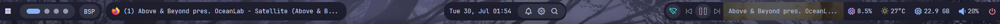

# 别再用Windows默认的任务栏了，试试YASB吧

先上设置完毕的效果图片吧！


那么想要拥有同款状态栏吗？跟着这份教程就够了，除此之外，希望你可以懂一丢丢 **前端** 的知识，像**css**和**config.yaml**这类的文件可能在之后要用到。

不过不懂也没关系！YASB的作者提供了详细的配置文件供小白使用！后面我也会给出~

首先我想让大家了解什么是YASB，全称为[**Yet Another Status Bar**](https://github.com/amnweb/yasb?tab=readme-ov-file)，中文翻译过来就是**又一个状态栏**，但是我觉得这个小东西的实用价值远超状态栏，不只是因为可以自定义的原因，更多的是它所承载的功能.简直是Windows默认状态栏的好几十倍！

比如说：你可以在[YASB](https://github.com/amnweb/yasb?tab=readme-ov-file)上完成开始菜单的所有功能；还可以设计自己喜欢的**日历**以及**时间**风格；要是想快速了解天气详情也是可以的；查看硬件/网络状态也是可以轻松搞定；当然这样的插件还有差不多40+，你完全可以根据自己的需要添加合适的插件，如果实在没有的话，自己也可以搓一个！这和默认的任务栏相比简直不要太香。


而且全部开源！所见即所得！感谢[YASB](https://github.com/amnweb/yasb?tab=readme-ov-file)的作者[amnweb](https://github.com/amnweb)以及社区成员的无私奉献！

Salute ^ v ^ゞ

由于开发者是英语母语，而且教程也没有中文版本，想一键直达教程可以[点这里](https://github.com/amnweb/yasb?tab=readme-ov-file#installation)。接下来我就用汉化一下如何设置YASB~

## 1. 安装

### 需要的东西

- 字体：Nerd Fonts. 安装 [Nerd Fonts](https://www.nerdfonts.com/font-downloads) (推荐JetBrainsMono，因为如果你后面想要导入别人的主题，这个很方便！)

- 操作系统：Windows 10 & 11

### 安装包

- 从 [GitHub 发布页面](https://github.com/amnweb/yasb/releases/latest)下载最新的安装程序。

- 运行安装程序并按照屏幕上的指示完成安装!

### 其他方式安装

#### Winget

```
winget install --id AmN.yasb
```

#### Scoop

```
scoop bucket add extras
scoop install extras/yasb
```

#### Chocolatey

```
choco install yasb
```

#### Python

- 安装 Python 3.12
- 安装应用程序及其依赖项：
  - `pip install` .（用于常规安装）
  - `pip install -e .[dev]`（用于开发者安装）
- 启动应用程序：
- 在终端中运行 `python src/main.py`（或点击 [yasb.vbs](https://github.com/amnweb/yasb/blob/main/src/yasb.vbs)）
- 按照您的喜好配置 [style.css](https://github.com/amnweb/yasb/blob/main/src/styles.css) 和 [config.yaml](https://github.com/amnweb/yasb/blob/main/src/config.yaml)。

好啦！安装完成你应该可以在桌面的上方看到你的新状态栏啦！是不是和下面的一样，那么接下来我将教你如何自定义你的YASB！



## 2. 自定义

其实自定义你自己的YASB很简单，你只需要这两个文件即可，就是上面提到的`style.css`和`config.yaml`，一个是样式文件，而另一个则是配置文件~

那么我们就先从第二个配置文件开始吧！

### 配置文件-config.yaml

如何找到你的YASB默认配置文件呢？

- 右击YASB托盘图标，点击`Open Config`按钮即可，或者直接在Windows资源管理器输入以下代码也能直达！

```
%USERPROFILE%\.config\yasb
```
- 双击打开即可看见里面的所有配置了，大多数配置不用过度修改，放在那里即可，当然你也可以根据作者的注释进行调整。

这里我给大家讲一下主要可以自定义的几个部分！

- widgets的位置部分

即存放你的widgets的部分代码，你可以通过修改位置来自定义，代码(#40)如下：

```
widgets:
      left:
      - "home"
      - "komorebi_workspaces"
      - "komorebi_active_layout"
      - "active_window"
      center:
      - "clock"
      right:
      - "media"
      - "weather"
      - "microphone"
      - "volume"
      - "notifications"
      - "power_menu"
```

注意！双引号里面就是我前面提到的widgets的名称！可以根据需求自行添加或者删除~

- widgets的功能配置文件

上面说到的只是位置的相关部分，要导入widgets，可以先看下以下格式：

```
  home:
    type: "yasb.home.HomeWidget"
    options:
      label: "<span>\udb81\udf17</span>"
      menu_list:
      - { title: "User Home", path: "~" }
      - { title: "Download", path: "~\\Downloads" }
      - { title: "Documents", path: "~\\Documents" }
      - { title: "Pictures", path: "~\\Pictures" }
      system_menu: true
      power_menu: true
      blur: false
```

不难发现，其实所有的widgets的格式都是这样的，拿上面的home为例，其中`home`既是widget的名称，`type`为统一格式，`options`就是展开后的内容配置了，`\udb81`类似的代码就是图标的样式了（所以你还可以自定义图标哦~）然后下面的其他项都可以自己设置成自己常用的东西啦~

只要你理解这个之后，后面的所有widgets都是如此！

你也可以前往[YASB提供的Widgets](https://github.com/amnweb/yasb?tab=readme-ov-file#list-of-currently-available-widgets-in-yasb)来添加你想要的，做出最~~牛逼~~的状态栏！

### 样式文件-style.css

这个文件和上面的配置文件在一起的，打开你的`styles.css`即可自定义！

（注意！修改此项可能需要一定的前端基础，小白可以直接复制Widgets提供的默认Style即可正常使用！）

如果大佬想要自定义的话可以自己修改布局、颜色、间距、字体等等。如果做出了好看的主题也可以提交到YASB的相关Wiki，开源万岁！

好了


