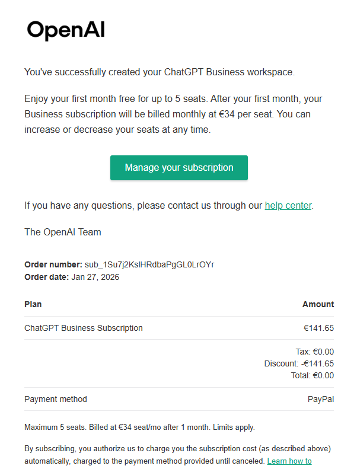
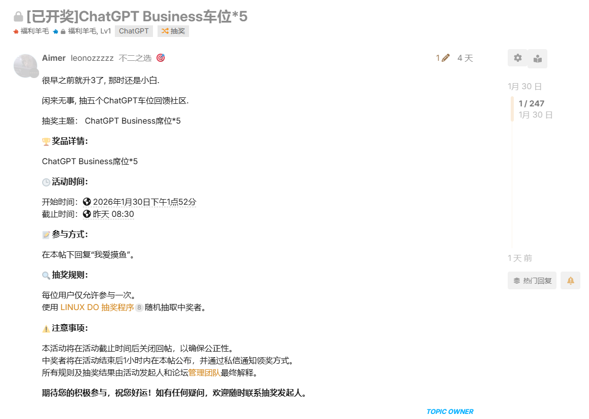

# 影子

前天偶然发现，ChatGPT 的头像上多了一个“Free Plus Trial”的标签。估计是 OpenAI 看我用了这么久还没开会员，于是扔了个“免费试用”来引诱我（笑）。
我心想：那就试试看呗。结果没想到卡验证这关直接卡死——我手头没有外卡，用网上那些“随机生成”的卡号、有效期、CVV，甚至是 L 站好心人分享的“一刀卡”都没戏，直接寄。

一天后，我在 L 站刷到这篇帖子：[10分钟通关瑞士万事达卡（Fiat24），≈0成本，从此绑卡不求人](https://linux.do/t/topic/761443)。当时嫌麻烦没动手，后来抽空试了试，发现确实能行，只是有几个小坑值得注意，于是有了这篇记录。

---

## 注册虚拟银行卡

注册流程完全可以照着上面那篇帖子来走，不赘述。
如果你本身就有 ChatGPT 支持的外币卡，那自然最好；但如果没有，不妨试试 Fiat24 这张卡。我之前试过 YPT 虚拟卡，但因为不支持中国大陆用户 KYC（身份验证）而失败。

Fiat24 总体体验还不错，但我个人对它的安全性仍有些顾虑，主要在以下几点：

* 卡片有效期只有五年，暂不清楚到期后是否需要续费；
* 充值方式似乎只能通过虚拟货币（我当时的路径是 RMB → 微信 → 币安 → USDT/ETH → SafePal 钱包 → Fiat24）；
* 虽然卡片可以绑定支付宝、微信，但能否正常使用或退款仍存疑，论坛里也有人反馈支付宝退款不成功。

关于 Fiat24 和 SafePal 的背景，这里附上网友整理的资料供参考：

Fiat24 成立于 2018 年，总部位于瑞士苏黎世，法定名称为 SR Saphirstein AG。主要机构投资者包括 SafePal（战略投资者）、华山资本、HashKey Capital、红点中国基金和 LIF。
SafePal 则是一家加密资产钱包服务商，由币安实验室于 2018 年孵化，投资方包括币安、Superscrypt、Archerman Capital 等。两家公司确实有合作与投资关系。

总体来说，注册和开卡过程都算顺利。**提醒一点：开卡时不要使用代理。**

---

## 通过 ChatGPT 验证卡片

卡虽然有了，但真正的难点在验证阶段。
每次输入卡号、有效期、CVV 后，系统都返回一句冷冰冰的提示：**“Your card has been declined.”**
起初我怀疑是卡的问题，查了半天发现别人同样的卡却能过。于是我开始怀疑问题出在 IP 或账单地址（Billing Address）上。

最终的解决方法如下：

1. 科学上网的 IP 选择 **台湾台北市**；
2. Billing Address（账单地址）可以用随机美国地址生成网站生成，但地区填写台湾；
3. 输入卡号、有效期、CVV 后提交，再通过人机验证；
4. 成功后，你的邮箱会收到一封类似这样的订阅确认邮件（如下图所示）：

此时你就能愉快地使用 ChatGPT Plus 啦！

---

## 后记

这次折腾算是涨了不少见识。
没想到原来还可以通过这种方式开通 ChatGPT Plus。希望这张卡未来能物尽其用，不止那 10 刀的价值。

感谢阅读，希望这篇文章能帮你顺利通过验证。如果遇到问题或有更好的方案，也欢迎留言讨论。祝你使用愉快！

---

(Update: 2026年2月3日)

## ChatGPT Business过卡

没想到这篇博客后续还有羊毛可以薅, 以为只是注册一个月的GPT Plus就完了, 之前也是爽用Codex和图片生成以及Sora, 前几天过了ChatGPT Business的验证, 现在又可以爽用GPT5.2和上面说的那些了, 这里就再多记录一点吧, 其中包括我遇到的一些问题.

### 1. 注册新的帐号

已经薅过一个月Plus的帐号应该是不能再薅Business的了, 起码我的大号是这样的, 然后我拿我用L站注册的小号试了下, 发现有这个资格, 但是之前也是苦于没有卡用来过验证, 也是不了了之了.

### 2. 过卡验证

这次我是用paypal来过的验证! 记得过完之后取消就好了, 用之前的那张卡应该是不行了, 一卡多绑应该是会触发风控, 会直接提示"**Your card has been declined.**" 但是地址这次我发现选台湾好像还是不行, 后面多试了几次, 发现不能用我原来的名字了, 我就用fake id捏了虚拟的数据提交上去, 成了! 一个月免费+5个席位! 这里我觉得要注意的点就是你的id和你的ip地址要一致应该就都行, 我用的是漂亮国的.

### 3. 后记

可能这个月用完之后还会去试试新号来看还能不能薅点羊毛吧, 后面那几个席位也是在L站抽奖抽掉了, 之前挂闲鱼说违规, 不能发关于ChatGPT帐号相关的虚拟商品, 还不如回馈给佬友们! 毕竟咱们加入社区这么久也没啥好回馈社区的. 就写这么多吧, 不知道这篇博客还会不会更新哈哈...

