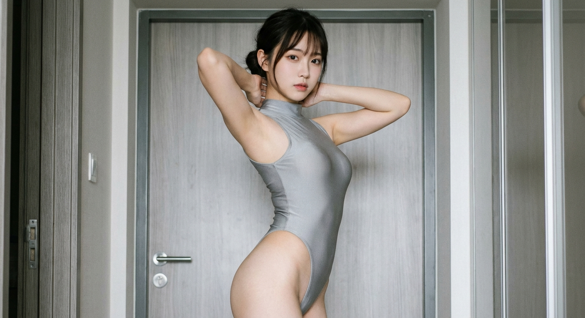
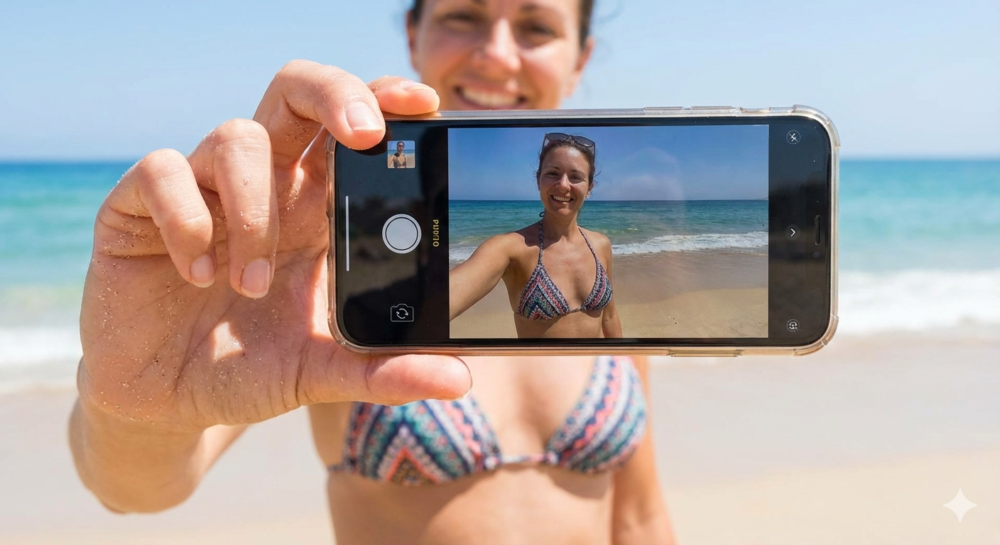
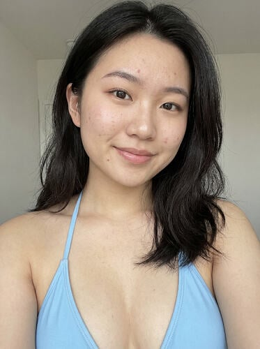

# 影子

好像每次发布新模型，新IDE总会有几种不同的声音，左派和右派以及中间派，左派认为新模型的发布势必会给程序员的行业带来翻天覆地的改变，什么‘前端已死’，‘AI制作的效果强于自己’之类的，右派则偏向于保守一点的看法，他们则认为：AI现在做出来的东西还是有一定局限性，但是一代比一代好了，中间派则只是知道了此次更新，别的东西也只是看看，不做过多的评价。

对于我来说可能偏左派一些吧，毕竟对于我这类半吊子的码农来说，AI能做出这样的效果已经超过我不知道多少了，自己只能算是个“智能人工”。但是这丝毫不影响我对这些工具的使用和了解，很喜欢之前在大阮的博客摘抄的一句话，人工智能可以加快你上手某一件事情的速度，我感觉用这个来规范一些企业使用人工智能或者我们自己使用来说，还是相当正确的。（不过这句话听上去官味很重）。

# Gemini 3

这也算是谷歌最近出的一个‘王炸’模型了，在其擅长的生成文本的方面还是一如既往的强大，这次升级，更大的变化是它审美的变化，之前可能做出来的一些网页或者小东西会有一些瑕疵，很多小虫，升级为 Gemini 3 以后，制作前端的效果有了质的飞跃，给我最大的惊喜就是审美更加在线了，即做出来的东西基本上能大差不差的达到我们自己的预期，这里放几个网友制作的demo仅供参考：

[SaaS Landing页面](https://gemini.google.com/share/e68ebd977314)

[天气卡片](https://jsbin.com/wocehoqiva/1/edit?html,output)

[网站首页](https://gemini.google.com/share/63cedb25c497)

此外，Gemini 3的 3d 理解也是十分出色的，这里从Nano Banana Pro也能看出，所以后面再讲吧！总的来说我对这次Gemini 3的升级还是蛮满意的，再补充一点，Gemini 3还有一个鲜为人知的功能这次也做出了加强，就是他的ocr图片识别功能，希望以后可以在AR/VR设备中看见它的身影吧。

# Nano Banana Pro

这个就是之前大香蕉的升级版了, 使用下来总体的感觉就是对于3D立体的事物, 以及光线阴影的理解要更加到位了, 多说无益, 下面有图有真相!

可以看到, 这几张照片的真实性还是有很大的提升的, 之前Gemini的图片生成能力在我的印象中还是'弟中之弟'的水平, 没想到这次的提升如此之大! 这次的升级, 使得Gemini 3的图片生成能力达到了一个新的高度, 甚至可以媲美一些专业的图像生成工具。

# Antigravity

没错, 在这个大厂纷纷造IDE的时代, 谷歌也入局了.

虽然这个时间有点晚了, 但还算是蹭上了这次IDE的末班车吧, 我目前接触过的就有快5家了吧, Windsurf(据说反重力这次的开发里面的工程师是前Windsurf的开发人员), Cursor, Qoder, 还有这次的Antigravity, 还有部分Cli就不列出来了.

这些IDE都是把自己家/别人家的AI集成到编辑器(VSC)中去, 然后使用订阅机制来获取利润.

不过这次谷歌大善人给的还是蛮多的, Gemini 3 Pro以及Claude 4.5, 这些现在还都可以白嫖.

其他的优势那就是和自己家最大的Chrome浏览器的联动了, 反重力可以在你的Chrome上直接安装一个插件(浏览器), 然后代替你操作浏览器来测试一些网页的运行情况, 从而作出调整, 这一点还是蛮有创新的!

这就是我对这次谷歌憋的王炸的一些看法了, 总体来说: 其他AI公司以及小的AI公司已经瑟瑟发抖了吧哈哈哈, 现在都在搞AI军备竞赛, 感觉以后可能会用于国防或者武器上面, 现阶段还是涩涩和生产力比较多.
