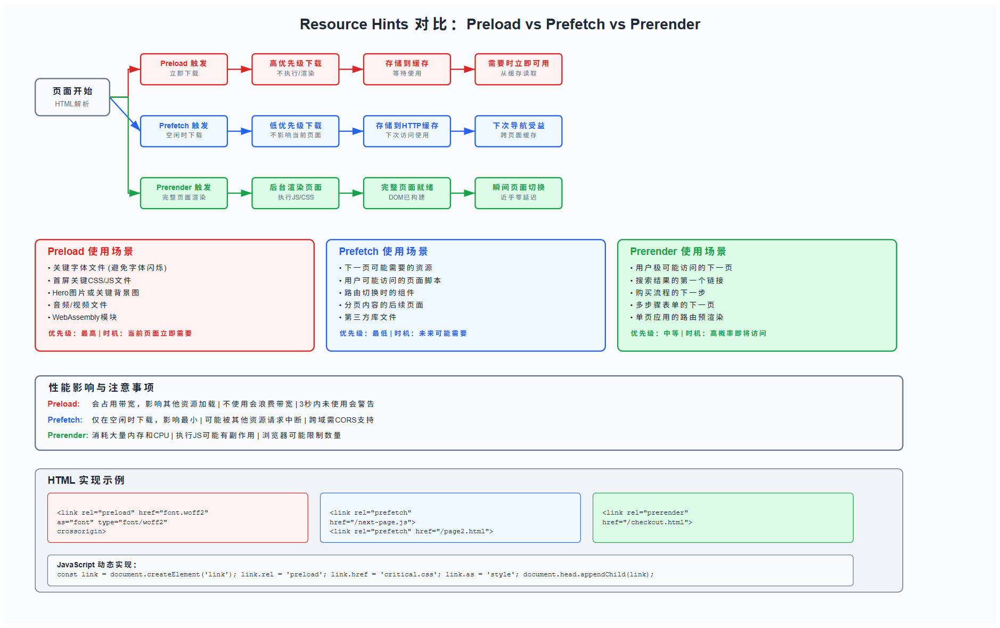

import Card from '@/components/Card.tsx';


## 影子

在检查网站一些页面发现的问题：某个资源（字体、图片等）设置了预加载但是很长时间没有使用上，具体报错见下图。

<Card client:load>
⚠️ The resource **X** was preloaded using link preload but not used within a few seconds from the window's load event. Please make sure it has an appropriate `as` value and it is preloaded intentionally.
</Card>

后面查找互联网发现这类资源其实可以使用`prefetch`以及`prerender`类型来加载，所以想要写一篇博客来记录一下这几种加载方式之间的区别。

## Preload

这类型的资源正如其名，通常用在某些需要 Preload (**预加载**) 的资源上。

- **语义**：告诉Chrome我马上就要用这个资源，立马去下载。
- **适用场景**：某些关键的CSS、字体、Hero大图等。
- **用法**：

```html
<link rel="preload" href="/style.css" as="style">
<link rel="preload" href="/font.woff2" as="font" type="font/woff2" crossorigin>
```

- **影响**：提高交互响应的时间，加快页面的呈现速度，但是加载了没有使用的资源，有点浪费**流量**+**带宽**。

## Prefetch

这个类型其实和Preload有些许类似但是又不同，字面意思是**预取**，有点**投机加载**的意思，就是有点像告知然后再取，提前通知一下。

- **语义**：告诉浏览器这个资源我待会可能要用，有空再下载。
- **适用场景**：下一页的JS、用户下一步要访问的详情页的资源。
- **用法**：

```html
<link rel="prefetch" href="/next-page.js" as="script">
```

- **影响**：和**Preload**就有点刚好相反，减少了**流量**和**带宽**的使用，为下个页面加载带来了速度，但是也有可能**白下资源**(用户没有点击下一个页面)。

## Prerender

这个类型是前两者的进阶版，属于页面级别的优化，提前加载整个页面的类型。

- **语义**：浏览器不仅提前下载资源，还直接在后台 **把整个页面渲染好**。
- **适用场景**：只有唯一的跳转页面那种吧，比如说登录页面。
- **用法**：

```html
<link rel="prerender" href="https://example.com/next-page">
```

- **影响**：下载 HTML、CSS、JS、图片等所有依赖，在后台偷偷执行 JS、构建 DOM、布局绘制，等用户真的点进来时，几乎可以瞬间切换，像“秒开”。但是资源消耗比较严重，可能会使起始页面加载缓慢。

## 三者对SEO的影响

**preload = 和 SEO 最相关（Core Web Vitals 加分项）**

**prefetch = 只影响用户体验，SEO 间接好处**

**prerender = 基本无关 SEO，更多是产品体验优化**

基本上都是使用preload来加载一些小的样式或者脚本来提升UX，其次还是CWV的加分项，prefetch感觉某些不需要使用的元素可以使用，然后prerender很少用，可以用来优化产品体验。

## 后记

用GPT搞一个表格总结一下吧！

|     特性     |   preload    |     prefetch     |            prerender            |
| :----------: | :----------: | :--------------: | :-----------------------------: |
| **加载粒度** |   单个资源   |     单个资源     |            整个页面             |
|  **优先级**  |      高      |        低        |          高（但受限）           |
| **执行 JS**  |      否      |        否        |               是                |
|   **风险**   |   浪费带宽   |     白下资源     |       资源+CPU+内存都浪费       |
| **典型场景** | 首屏字体/CSS | 可能的下一页脚本 | 搜索结果页 → 用户常点第一条结果 |



三者各有各的好处吧，灵活运用，不过Preload还是最常用的，其他两个感觉使用的频率很低~

---

