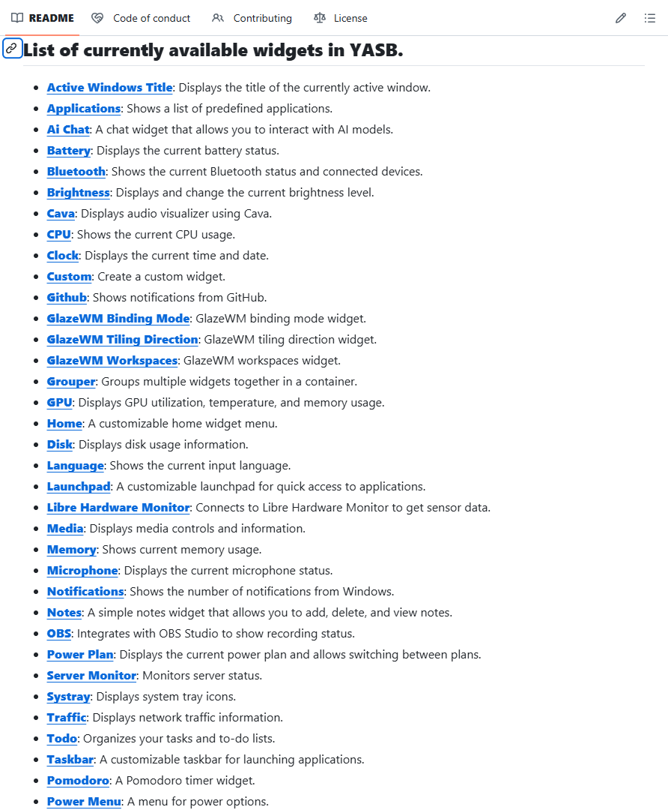
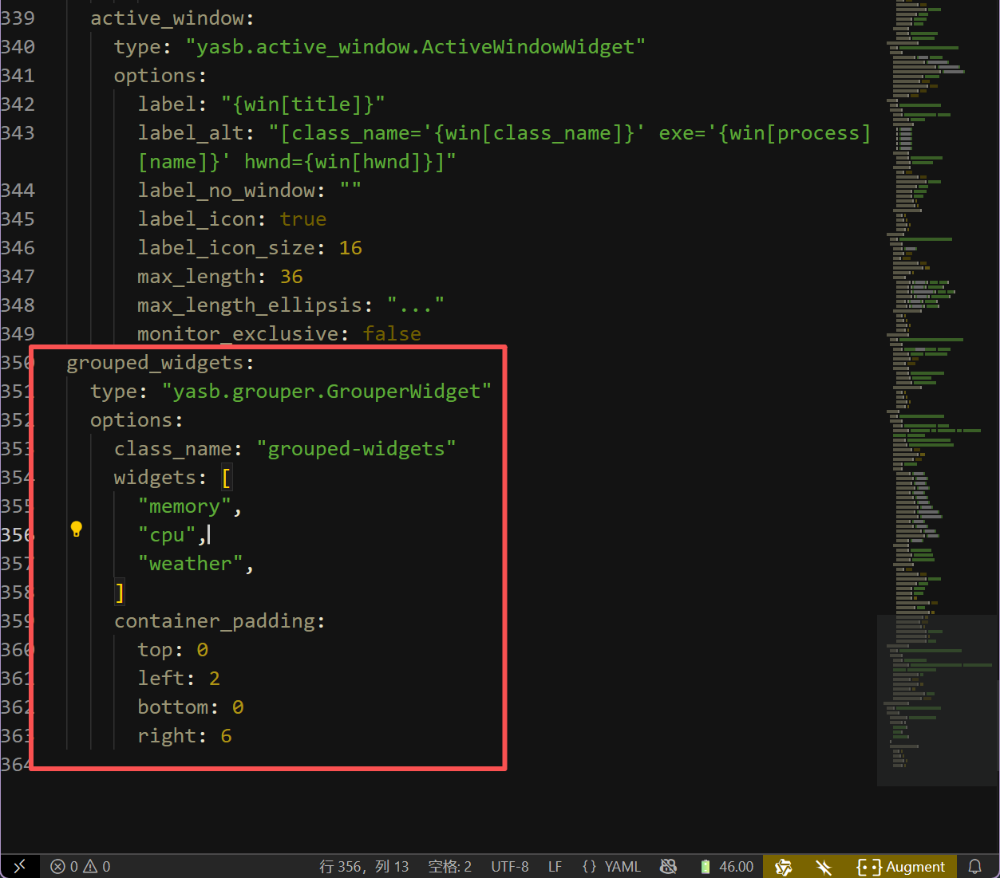
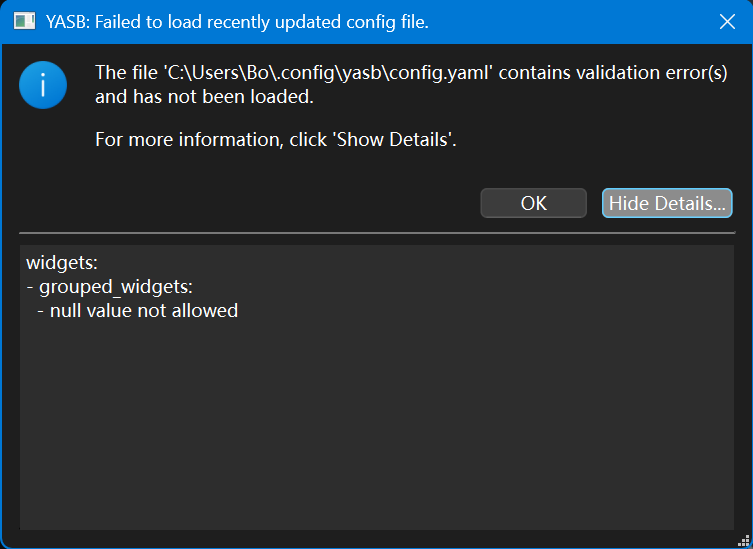

# 别再用Windows默认的任务栏了，试试YASB吧

(超长文预警！！！)

先上设置完毕的效果图片吧！


那么想要拥有同款状态栏吗？跟着这份教程就够了，除此之外，希望你可以懂一丢丢 **前端** 的知识，像**css**和**config.yaml**这类的文件可能在之后要用到。

不过不懂也没关系！YASB的作者提供了详细的配置文件供小白使用！后面我也会给出~

首先我想让大家了解什么是YASB，全称为[**Yet Another Status Bar**](https://github.com/amnweb/yasb?tab=readme-ov-file)，中文翻译过来就是**又一个状态栏**，但是我觉得这个小东西的实用价值远超状态栏，不只是因为可以自定义的原因，更多的是它所承载的功能.简直是Windows默认状态栏的好几十倍！

比如说：你可以在[YASB](https://github.com/amnweb/yasb?tab=readme-ov-file)上完成开始菜单的所有功能；还可以设计自己喜欢的**日历**以及**时间**风格；要是想快速了解天气详情也是可以的；查看硬件/网络状态也是可以轻松搞定；当然这样的插件还有差不多40+，你完全可以根据自己的需要添加合适的插件，如果实在没有的话，自己也可以搓一个！这和默认的任务栏相比简直不要太香。



而且全部开源！所见即所得！感谢[YASB](https://github.com/amnweb/yasb?tab=readme-ov-file)的作者[amnweb](https://github.com/amnweb)以及社区成员的无私奉献！

Salute ^ v ^ゞ

由于开发者是英语母语，而且教程也没有中文版本，想一键直达教程可以[点这里](https://github.com/amnweb/yasb?tab=readme-ov-file#installation)。接下来我就用汉化一下如何设置YASB~

## 1. 安装

### 需要的东西

- 字体：Nerd Fonts. 安装 [Nerd Fonts](https://www.nerdfonts.com/font-downloads) (推荐JetBrainsMono，因为如果你后面想要导入别人的主题，这个很方便！)

- 操作系统：Windows 10 & 11

### 安装包

- 从 [GitHub 发布页面](https://github.com/amnweb/yasb/releases/latest)下载最新的安装程序。

- 运行安装程序并按照屏幕上的指示完成安装!

### 其他方式安装

#### Winget

```
winget install --id AmN.yasb
```

#### Scoop

```
scoop bucket add extras
scoop install extras/yasb
```

#### Chocolatey

```
choco install yasb
```

#### Python

- 安装 Python 3.12
- 安装应用程序及其依赖项：
  - `pip install` .（用于常规安装）
  - `pip install -e .[dev]`（用于开发者安装）
- 启动应用程序：
- 在终端中运行 `python src/main.py`（或点击 [yasb.vbs](https://github.com/amnweb/yasb/blob/main/src/yasb.vbs)）
- 按照您的喜好配置 [style.css](https://github.com/amnweb/yasb/blob/main/src/styles.css) 和 [config.yaml](https://github.com/amnweb/yasb/blob/main/src/config.yaml)。

好啦！安装完成你应该可以在桌面的上方看到你的新状态栏啦！是不是和下面的一样，那么接下来我将教你如何自定义你的YASB！


## 2. 自定义

其实自定义你自己的YASB很简单，你只需要这两个文件即可，就是上面提到的`style.css`和`config.yaml`，一个是样式文件，而另一个则是配置文件~

那么我们就先从第二个配置文件开始吧！

### 配置文件-config.yaml

如何找到你的YASB默认配置文件呢？

- 右击YASB托盘图标，点击`Open Config`按钮即可，或者直接在Windows资源管理器输入以下代码也能直达！

```
%USERPROFILE%\.config\yasb
```
- 双击打开即可看见里面的所有配置了，大多数配置不用过度修改，放在那里即可，当然你也可以根据作者的注释进行调整。

这里我给大家讲一下主要可以自定义的几个部分！

- widgets的位置部分

即存放你的widgets的部分代码，你可以通过修改位置来自定义，代码(#40)如下：

```
widgets:
      left:
      - "home"
      - "komorebi_workspaces"
      - "komorebi_active_layout"
      - "active_window"
      center:
      - "clock"
      right:
      - "media"
      - "weather"
      - "microphone"
      - "volume"
      - "notifications"
      - "power_menu"
```

注意！双引号里面就是我前面提到的widgets的名称！可以根据需求自行添加或者删除~

- widgets的功能配置文件

上面说到的只是位置的相关部分，要导入widgets，可以先看下以下格式：

```
  home:
    type: "yasb.home.HomeWidget"
    options:
      label: "<span>\udb81\udf17</span>"
      menu_list:
      - { title: "User Home", path: "~" }
      - { title: "Download", path: "~\\Downloads" }
      - { title: "Documents", path: "~\\Documents" }
      - { title: "Pictures", path: "~\\Pictures" }
      system_menu: true
      power_menu: true
      blur: false
```

不难发现，其实所有的widgets的格式都是这样的，拿上面的home为例，其中`home`既是widget的名称，`type`为统一格式，`options`就是展开后的内容配置了，`\udb81`类似的代码就是图标的样式了（所以你还可以自定义图标哦~）然后下面的其他项都可以自己设置成自己常用的东西啦~

只要你理解这个之后，后面的所有widgets都是如此！

你也可以前往[YASB提供的Widgets](https://github.com/amnweb/yasb?tab=readme-ov-file#list-of-currently-available-widgets-in-yasb)来添加你想要的，做出最~~牛逼~~的状态栏！

### 样式文件-style.css

这个文件和上面的配置文件在一起的，打开你的`styles.css`即可自定义！

（注意！修改此项可能需要一定的前端基础，小白可以直接复制Widgets提供的默认Style即可正常使用！）

如果大佬想要自定义的话可以自己修改布局、颜色、间距、字体等等。如果做出了好看的主题也可以提交到YASB的相关Wiki，开源万岁！

### 安装主题

好了，如果你不喜欢折腾的话，YASB也提供了一些现成的主题。

可以前往YASB的官方Github页面下载 

[传送门](https://github.com/amnweb/yasb-themes)

食用方法也和上面两个文件`config.yaml`和`style.css`，只需要把你下载的主题的对应的两个文件复制到前面提到的这个路径即可！

```
%USERPROFILE%\.config\yasb
```

然后重启YASB即可！或者也可以直接右键托盘图标，点击`Get Themes`然后安装你喜欢的主题即可！

值得注意的是有些主题有一些对于字体以及插件的要求，最好看清楚再安装！


## 3. 一些常见的问题

 **Q**: 保存config文件之后提示unknown field`，如何解决？

 

 **A**: 这是因为你的config文件某个地方的格式有误，可以参考下方的图片进行缩进的更改来修复！
 
 (下图是错误的格式，注意active-windows和grouped_widgets的区别，需要调整到同一行缩进！)

 

  **Q**: 保存config文件之后提示`null value not allowed`，如何解决？

 

 **A**: 这是也是因为你的config某个地方的格式有误，可以参考下方的图片进行缩进的更改来修复！
 
 (和上面一样，注意type的缩进！要在grouped_widgets的下一级！)

 

更多问题可以前往 [issues](https://github.com/amnweb/yasb/issues) 进行反馈！和查找解决方案！也欢迎在该博客下方留言！有空会回复！(●'◡'●)

好了，这就是我对于YASB的全部理解！希望本篇指南有帮助到你！也欢迎在评论区秀出你自己的配置！下面就贴两个我自己的配置吧！有需要的朋友可以自取！不过天气的API要自己去获取哦，怕别人狂刷我的API ಥ_ಥ

## 我的配置

### config.yaml

```
watch_stylesheet: true
watch_config: true
debug: false
update_check: true
komorebi:
  start_command: "komorebic start --whkd"
  stop_command: "komorebic stop --whkd"
  reload_command: "komorebic stop --whkd && komorebic start --whkd"
bars:
  primary-bar:
    enabled: true
    screens: ["primary"]
    class_name: "yasb-bar"
    alignment:
      position: "top"
      center: false
    animation:
      enabled: true
      duration: 400
    blur_effect:
      enabled: true
      acrylic: false
      dark_mode: true
      round_corners: true
      round_corners_type: "normal"
      border_color: "None"
    window_flags:
      always_on_top: false
      windows_app_bar: true
    dimensions:
      width: "100%"
      height: 32
    padding:
      top: 4
      left: 4
      bottom: 4
      right: 4
    widgets:
      left: 
      - "home"
      - "komorebi_workspaces"
      - "active_window"
      center:
      - "clock"
      right:
      - "systray"
      - "grouped_widgets"
      - "language"
      - "media"
      - "volume"
      - "notifications"
      - "power_menu"
widgets:
  media:
    type: "yasb.media.MediaWidget"
    options:
      label: "{title} - {artist}"
      label_alt: "{title}"
      hide_empty: true
      callbacks:
        on_left: "toggle_media_menu"
        on_middle: "toggle_play_pause"
        on_right: "toggle_label"
      max_field_size:
        label: 16
        label_alt: 16
      show_thumbnail: true
      controls_only: false
      controls_left: false
      controls_hide: true
      thumbnail_edge_fade: true
      thumbnail_padding: 32
      scrolling_label:
        enabled: true
        update_interval_ms: 50
        style: "left"
        separator: " "
        label_padding: 2
        ease_slope: 20
        ease_pos: 0.8
        ease_min: 0.5
      icons:
        prev_track: "\ue892"
        next_track: "\ue893"
        play: "\ue768"
        pause: "\ue769"
      media_menu:
        blur: true
        round_corners: true
        round_corners_type: "normal"
        border_color: "None"
        alignment: "right"
        direction: "down"
        offset_top: 6
        offset_left: 0
        thumbnail_corner_radius: 4
        thumbnail_size: 80
        max_title_size: 60
        max_artist_size: 20
        show_source: true
      media_menu_icons:
        play: "\ue768"
        pause: "\ue769"
        prev_track: "\ue892"
        next_track: "\ue893"
  language:
    type: "yasb.language.LanguageWidget"
    options:
      label: "<span>\uf11c</span> {lang[country_code]}"
      label_alt: "{lang[full_name]}"
      update_interval: 5
      callbacks:
        on_left: "toggle_menu"
        on_middle: "do_nothing"
        on_right: "toggle_label"
      language_menu:
        blur: true
        round_corners: true
        round_corners_type: "normal"
        border_color: "None"
        alignment: "right"
        direction: "down"
        offset_top: 6
        offset_left: 0
        show_layout_icon: true
        layout_icon: "\uf11c"
      container_padding:
        top: 0
        left: 2
        bottom: 0
        right: 2
  memory:
    type: "yasb.memory.MemoryWidget"
    options:
      label: "MEM"
      label_alt: "VIRT: {virtual_mem_percent}% SWAP: {swap_mem_percent}%"
      update_interval: 5000
      progress_bar:
        enabled: true
        size: 14
        thickness: 2
        color: "#91d7e3"
        background_color: "#242739" 
      callbacks:
        on_left: "toggle_label"
      memory_thresholds:
        low: 25
        medium: 50
        high: 90
  cpu:
    type: "yasb.cpu.CpuWidget"
    options:
      label: "CPU"
      label_alt: "CPU {info[percent][total]:.0f}%"
      progress_bar:
        enabled: true
        position: "left"
        size: 14
        thickness: 2
        color: "#91d7e3"
        background_color: "#242739" 
      update_interval: 2000
      callbacks:
        on_right: "do_nothing"
  systray:
    type: "yasb.systray.SystrayWidget"
    options:
      class_name: "systray"
      label_collapsed: "\uf47d"
      label_expanded: "\uf460"
      label_position: "right"
      icon_size: 16
      pin_click_modifier: "alt"
      show_unpinned: false
      show_unpinned_button: true
      show_battery: false
      show_volume: false
      show_network: false
      tooltip: true
  home:
    type: "yasb.home.HomeWidget"
    options:
      label: "<span>\uf192</span>"
      menu_list:
      - { title: "User Home", path: "~" }
      - { title: "Download", path: "~\\Downloads" }
      - { title: "Documents", path: "~\\Documents" }
      - { title: "Pictures", path: "~\\Pictures" }
      system_menu: true
      power_menu: true
      blur: true
      border_color: "None"
      container_padding:
        top: 0
        left: 6
        bottom: 0
        right: 4
  clock:
    type: "yasb.clock.ClockWidget"
    options:
      label: "{%H:%M:%S}"
      label_alt: "{%A, %d %B %Y %H:%M}"
      timezones: []
      calendar: 
        blur: true
        round_corners: true
        round_corners_type: "normal"
        border_color: "None"
        alignment: "center"
        direction: "down"
      callbacks:
        on_left: "toggle_calendar"
        on_right: "toggle_label"
  komorebi_workspaces:
    type: "komorebi.workspaces.WorkspaceWidget"
    options:
      label_offline: "\u23fc Offline"
      label_workspace_btn: "\udb80\udd30"
      label_workspace_active_btn: "\udb80\udd2f"
      label_workspace_populated_btn: "\udb80\udd30"
      label_default_name: "{index}"
      label_zero_index: false
      hide_empty_workspaces: false
      hide_if_offline: true
      animation: false
  volume:
    type: "yasb.volume.VolumeWidget"
    options:
      label: "<span>{icon}</span> {level}"
      label_alt: "{level}"
      volume_icons:
        - "\ueee8"
        - "\uf026"
        - "\uf027"
        - "\uf027"
        - "\uf028"
      callbacks:
        on_left: "toggle_volume_menu"
        on_right: "toggle_mute"
      audio_menu:
        blur: true
        round_corners: true
        round_corners_type: "normal"
        border_color: "None"
        alignment: "center"
        direction: "down"
        offset_top: 6
        offset_left: 0
      container_padding:
        top: 0
        left: 2
        bottom: 0
        right: 2
  power_menu:
    type: "yasb.power_menu.PowerMenuWidget"
    options:
      label: "\uf011"
      uptime: true
      blur: false
      blur_background: true
      animation_duration: 200
      button_row: 3
      buttons:
        shutdown: ["\uf011", "Shut Down"]
        restart: ["\uead2", "Restart"]
        signout: ["\udb80\udf43", "Sign out"]
        hibernate: ["\uf28e", "Hibernate"]
        sleep: ["\u23fe", "Sleep"]
        cancel: ["\ueab8", "Close"]
      container_padding:
        top: 0
        left: 0
        bottom: 0
        right: 6
  notifications:
    type: "yasb.notifications.NotificationsWidget"
    options:
      label: "<span>\uf476</span> {count}"
      label_alt: "{count} notifications"
      hide_empty: true
      tooltip: false
      callbacks:
        on_left: "toggle_notification"
        on_right: "do_nothing"
        on_middle: "toggle_label"
      container_padding:
        top: 0
        left: 4
        bottom: 0
        right: 4
  weather:
    type: "yasb.weather.WeatherWidget"
    options:
      label: "<span>{icon}</span> {temp}"
      label_alt: "{location}: Min {min_temp}, Max {max_temp}, Humidity {humidity}"
      api_key: "替换你自己的API KEY"
      location: "$Env:YASB_WEATHER_LOCATION"
      show_alerts: true
      update_interval: 600
      hide_decimal: true
      units: "metric"
      icons:
        sunnyDay: "\ue30d"
        clearNight: "\ue32b"
        cloudyDay: "\ue312"
        cloudyNight: "\ue311"
        rainyDay: "\ue308"
        rainyNight: "\ue333"
        snowyIcyDay: "\ue30a"
        snowyIcyNight: "\ue335"
        blizzardDay: "\udb83\udf36"
        blizzardNight: "\udb83\udf36"
        foggyDay: "\ue303"
        foggyNight: "\ue346"
        thunderstormDay: "\ue30f"
        thunderstormNight: "\ue338"
        default: "\uebaa"
      callbacks:
        on_left: "toggle_card"
        on_middle: "do_nothing"
        on_right: "toggle_label"
      weather_card:
        blur: true
        round_corners: true
        round_corners_type: "normal"
        border_color: "None"
        alignment: "right"
        direction: "down"
        icon_size: 64
        show_hourly_forecast: true
        time_format: "24h"
        hourly_point_spacing: 76
        hourly_icon_size: 32
        icon_smoothing: true
        temp_line_width: 2
        current_line_color: "#8EAEE8"
        current_line_width: 2
        current_line_style: "dot"
  active_window:
    type: "yasb.active_window.ActiveWindowWidget"
    options:
      label: "{win[title]}"
      label_alt: "[class_name='{win[class_name]}' exe='{win[process][name]}' hwnd={win[hwnd]}]"
      label_no_window: ""
      label_icon: true
      label_icon_size: 16
      max_length: 36
      max_length_ellipsis: "..."
      monitor_exclusive: false
  grouped_widgets:
    type: "yasb.grouper.GrouperWidget"
    options:
      class_name: "grouped-widgets"
      widgets: [
        "memory",
        "cpu",
        "weather",
      ]
      container_padding:
        top: 0
        left: 2
        bottom: 0
        right: 6
```

### style.css


```
:root {
    --mauve: #cba6f7;
    --red: #f38ba8;
    --yellow: #f9e2af;
    --orange: #fab387;
    --blue: #89b4fa;
    --green: #94e2d5;
    --lavender: #b4befe;
    --text: #cdd6f4;
    --subtext1: #bac2de;
    --subtext0: #a6adc8;
    --overlay2: #9399b2;
    --overlay1: #7f849c;
    --overlay0: #6c7086;
    --surface2: #585b70;
    --surface1: #45475a;
    --surface0: #282936;
    --base: rgb(17, 18, 19);
    --crust: rgba(32, 32, 43, 0.8);
}
* {
    font-size: 12px;
    color: var(--text);
    font-weight: 600;
    font-family: "JetBrainsMono NFP";
    margin: 0;
    padding: 0;
}
.yasb-bar {
    padding: 0;
    margin: 0;
    background-color: var(--crust);
}
/* Global styles for ToolTip */
.tooltip {
    background-color: var(--base);
    border: 1px solid var(--surface0);
    border-radius: 4px;
    color: var(--text);
    padding: 4px 8px 5px 8px;
    font-size: 12px;
    font-family: 'Segoe UI';
    font-weight: 600;
    margin-top: 4px;
}
/* Global styles for Progress Circle */
.progress-circle {
    padding-right: 4px;
}
/* Global context menu style */
.context-menu,
.context-menu .menu-checkbox {
    background-color: #202020;
    border: none;
    padding: 4px 0px;
    font-family: 'Segoe UI';
    font-size: 12px;
    color: #FFFFFF;
}
.context-menu::right-arrow {
    width: 8px;
    height: 8px;
    padding-right: 24px;
}
.context-menu::item,
.context-menu .menu-checkbox {
    background-color: transparent;
    padding: 6px 12px;
    margin: 2px 6px;
    border-radius: 4px;
    min-width: 100px;
}
.context-menu::item:selected,
.context-menu .menu-checkbox:hover {
    background-color: #313131;
    color: #FFFFFF;
}
.context-menu::separator {
    height: 1px;
    background-color: #404040;
    margin: 4px 8px;
}
.context-menu::item:disabled {
    color: #666666;
    background-color: transparent;
}
.context-menu .menu-checkbox .checkbox {
    border: none;
    padding: 8px 16px;
    font-size: 12px;
    margin: 0;
    color: #FFFFFF;
    font-family: 'Segoe UI'
}
.context-menu .submenu::item:disabled {
    margin: 0;
    padding-left: 16px;
}
.context-menu .menu-checkbox .checkbox:unchecked {
    color: #999
}
.context-menu .menu-checkbox .checkbox::indicator {
    width: 12px;
    height: 12px;
    margin-left: 0px;
    margin-right: 8px;
}
.context-menu .menu-checkbox .checkbox::indicator:unchecked {
    background: #444444;
    border-radius: 2px;
}
.context-menu .menu-checkbox .checkbox::indicator:checked {
    background: #007acc;
    border-radius: 2px;
}
.context-menu .menu-checkbox .checkbox:focus {
    outline: none;
}
.widget {
    padding: 0 3px;
    margin: 0;
}
.icon {
    font-size: 11px;
    padding-right: 4px;
}
.widget .label {
    padding: 0px 2px;
}
.grouped-widgets .container {
    background-color: var(--base);
    margin: 4px 0 4px 0;
    border-radius: 12px;
    border: 1px solid var(--surface1);
}
.komorebi-workspaces .offline-status {
    color: var(--surface2);
    font-size: 12px;
    padding: 0 0 0 4px;
    font-weight: 600;
}
.komorebi-workspaces .ws-btn {
    border: none;
    background-color: transparent;
    margin: 0 3px;
    padding: 0;
    font-size: 14px;
    color: var(--surface2);
}
.komorebi-workspaces .ws-btn:hover {
    color: var(--overlay2);
}
.komorebi-workspaces .ws-btn.populated {
    color: var(--text);
}
.komorebi-workspaces .ws-btn.active {
    color: var(--text);
}
.cpu-widget .icon {
    color: var(--orange);
}
.memory-widget .label,
.cpu-widget .label {
    padding-right: 8px;
}
.clock-widget .label {
    color: var(--green);
}
.calendar {
    background-color: var(--crust)
}
.calendar .calendar-table,
.calendar .calendar-table::item {
    background-color: rgba(17, 17, 27, 0);
    color: rgba(162, 177, 196, 0.85);
    font-family: 'Segoe UI';
    margin: 0;
    padding: 0;
    border: none;
    outline: none;
}
.calendar .calendar-table::item:selected {
    color: rgb(255, 255, 255);
    background-color: #007acc;
    border-radius: 12px;
}
.calendar .day-label {
    margin-top: 20px;
}
.calendar .day-label,
.calendar .month-label,
.calendar .date-label,
.calendar .week-label,
.calendar .holiday-label {
    font-family: 'Segoe UI';
    font-size: 16px;
    color: #fff;
    font-weight: 700;
    min-width: 180px;
    max-width: 180px;
}
.calendar .month-label {
    font-weight: normal;
}
.calendar .week-label,
.calendar .holiday-label {
    font-size: 12px;
    font-weight: 600;
    color: rgba(162, 177, 196, 0.85);
}
.calendar .holiday-label {
    color: var(--red);
    font-weight: 700;
}
.calendar .date-label {
    font-size: 88px;
    font-weight: 900;
    color: rgb(255, 255, 255);
    margin-top: -20px;
    margin-bottom: -10px;
}
.power-menu-widget .label {
    color: var(--red);
    font-size: 15px;
}
.power-menu-popup {
    background-color: transparent
}
.power-menu-popup .button {
    padding: 0;
    width: 180px;
    height: 230px;
    border-radius: 0;
    background-color: var(--crust);
    color: var(--green);
    border-left: 4px solid rgba(58, 83, 80, 0);
    border-right: 4px solid rgba(58, 83, 80, 0);
    border-top: 4px solid rgba(58, 83, 80, 0);
    border-bottom: 4px solid rgba(58, 83, 80, 0);
    margin: 0px;
}
.power-menu-popup .button.hover {
    border-left: 4px solid #94e2d5;
    border-right: 4px solid #94e2d5;
    border-top: 4px solid #94e2d5;
    border-bottom: 4px solid #94e2d5;
}
.power-menu-popup .button.cancel.hover {
    border-left: 4px solid #e29494;
    border-right: 4px solid #e29494;
    border-top: 4px solid #e29494;
    border-bottom: 4px solid #e29494;
}
.power-menu-popup .button .label {
    margin-bottom: 8px;
    font-size: 16px;
    font-weight: 500;
    color: var(--green)
}
.power-menu-popup .button .icon {
    font-size: 64px;
    padding-top: 32px;
    color: var(--green)
}
.power-menu-popup .button.cancel .icon,
.power-menu-popup .button.cancel .label {
    color: var(--red);
}
.uptime {
    font-size: 14px;
    margin-bottom: 10px;
    color: var(--surface2);
    font-weight: 600;
}
.audio-menu {
    background-color: var(--crust)
}
.volume-widget .icon {
    font-size: 12px;
    color: var(--green);
}
.language-widget .icon {
    color: var(--green);
}
.language-menu {
    background-color: var(--crust);
    min-width: 300px;
}
.language-menu .header {
    font-family: 'Segoe UI';
    font-size: 14px;
    font-weight: 600;
    margin-bottom: 2px;
    padding: 12px;
}
.language-menu .footer {
    font-family: 'Segoe UI';
    font-size: 12px;
    font-weight: 600;
    padding: 12px;
    margin-top: 2px;
    color: #9399b2;
}
.language-menu .footer:hover {
    background-color: rgba(255, 255, 255, 0.05);
}
.language-menu .language-item {
    padding: 6px 12px;
    margin: 2px 4px;
}
.language-menu .language-item.active {
    background-color: rgba(255, 255, 255, 0.1);
    border-radius: 4px;
}
.language-menu .language-item:hover {
    background-color: rgba(255, 255, 255, 0.05);
}
.language-menu .language-item.active:hover {
    background-color: rgba(255, 255, 255, 0.1);
    border-radius: 4px;
}
.language-menu .language-item .code {
    font-weight: 900;
    font-size: 14px;
    min-width: 40px;
    text-transform: uppercase;
}
.language-menu .language-item .icon {
    font-size: 16px;
    margin-right: 8px;
    color: #fff;
}
.language-menu .language-item .name {
    font-weight: 600;
    font-family: 'Segoe UI';
    font-size: 14px;
}
.language-menu .language-item .layout {
    font-weight: 600;
    font-family: 'Segoe UI';
    font-size: 12px;
}
.systray {
    background: transparent;
    border: none;
    margin: 0;
    padding: 0;
}
.systray .button {
    border-radius: 4px;
    padding: 2px 2px;
    background-color: transparent;
}
.systray .button:hover,
.systray .unpinned-visibility-btn:hover {
    background: rgba(255, 255, 255, 0.1);
}
.systray .unpinned-visibility-btn {
    height: 20px;
    width: 16px;
    background-color: transparent;
    border: none;
    font-size: 14px;
}
.systray .unpinned-visibility-btn:hover {
    border-radius: 4px;
}
.home-widget {
    padding-right: 0;
}
.home-widget .icon {
    color: var(--lavender);
    font-size: 17px;
}
.home-widget .icon:hover {
    color: var(--text);
}
.home-menu {
    background-color: var(--crust);
    border-radius: 8px;
}
.home-menu .menu-item {
    padding: 8px 48px 9px 16px;
    font-size: 12px;
    font-family: 'Segoe UI';
    color: var(--text);
    font-weight: 600;
}
.home-menu .menu-item:hover {
    background-color: rgba(128, 130, 158, 0.15);
    color: #fff;
}
.home-menu .separator {
    max-height: 1px;
    background-color: rgba(128, 130, 158, 0.3);
}
.notification-widget .icon.new-notification {
    color: var(--blue);
}
.media-menu {
    min-width: 360px;
    max-width: 360px;
    background-color: var(--crust)
}
.media-menu .title,
.media-menu .artist,
.media-menu .source {
    font-size: 14px;
    font-weight: 600;
    margin-left: 10px;
    font-family: 'Segoe UI'
}
.media-menu .artist {
    font-size: 13px;
    color: #6c7086;
    margin-top: 0px;
    margin-bottom: 8px;
}
.media-menu .source {
    font-size: 11px;
    color: #000;
    font-weight: normal;
    border-radius: 3px;
    background-color: #bac2de;
    padding: 2px 4px;
}
.media-menu .source.firefox {
    background-color: #ff583b;
    color: #ffffff;
}
.media-menu .source.spotify {
    background-color: #199143;
    color: #ffffff;
}
.media-menu .source.edge {
    background-color: #0078d4;
    color: #ffffff;
}
.media-menu .source.windows-media {
    background-color: #0078d4;
    color: #ffffff;
}
.media-menu .btn {
    font-family: "Segoe Fluent Icons";
    font-size: 14px;
    font-weight: 400;
    margin: 10px 2px 0px 2px;
    min-width: 40px;
    max-width: 40px;
    min-height: 40px;
    max-height: 40px;
    border-radius: 20px;
}
.media-menu .btn.prev {
    margin-left: 10px;
}
.media-menu .btn:hover {
    color: white;
    background-color: rgba(255, 255, 255, 0.1);
}
.media-menu .btn.play {
    background-color: rgba(255, 255, 255, 0.1);
    font-size: 20px
}
.media-menu .btn.disabled:hover,
.media-menu .btn.disabled {
    color: #4e525c;
    background-color: rgba(0, 0, 0, 0);
}
.media-menu .playback-time {
    font-size: 13px;
    font-family: 'Segoe UI';
    color: #7f849c;
    margin-top: 0px;
    min-width: 100px;
}
.media-menu .progress-slider {
    height: 20px;
    margin: 0 4px 5px 4px;
    border-radius: 3px;
}
.media-menu .progress-slider::groove {
    background: transparent;
    height: 2px;
    border-radius: 3px;
    background: rgba(255, 255, 255, 0.1);

}
.media-menu .progress-slider::groove:hover {
    background: transparent;
    height: 6px;
    border-radius: 3px;
    background: rgba(255, 255, 255, 0.2);
}
.media-menu .progress-slider::sub-page {
    background: var(--blue);
    border-radius: 3px;
    height: 4px;
}
.weather-widget .icon {
    font-size: 14px;
    color: var(--yellow);
}
.weather-card {
    background-color: var(--crust);
}
.weather-card-today .label {
    font-size: 13px;
    font-weight: 600;
}
.weather-card-today .label.location {
    font-size: 32px;
    font-weight: 600;
}
.weather-card-today .label.alert {
    font-size: 13px;
    font-weight: 600;
    background-color: rgba(247, 175, 42, 0.05);
    border: 1px solid rgba(247, 209, 42, 0.1);
    color: rgba(196, 181, 162, 0.85);
    border-radius: 6px;
    padding: 5px 0;
}
.weather-card-day {
    border-radius: 6px;
    background-color: var(--crust)
}
.weather-card-day .label {
    font-size: 13px;

}
.weather-card-day.active {
    background-color: rgba(40, 40, 60, 0.6);
    border: 1px solid rgba(50, 50, 75, 1);
}
.weather-card-day:hover {
    background-color: rgba(40, 40, 60, 0.6);
}
.weather-card .hourly-container {
    border: none;
    background-color: rgba(40, 40, 60, 0.0);
    min-height: 150px;
}
.weather-card .hourly-data {
    background-color: #FAE93F;
    font-size: 11px;
    font-weight: bold;
}

```

_END..._
---


