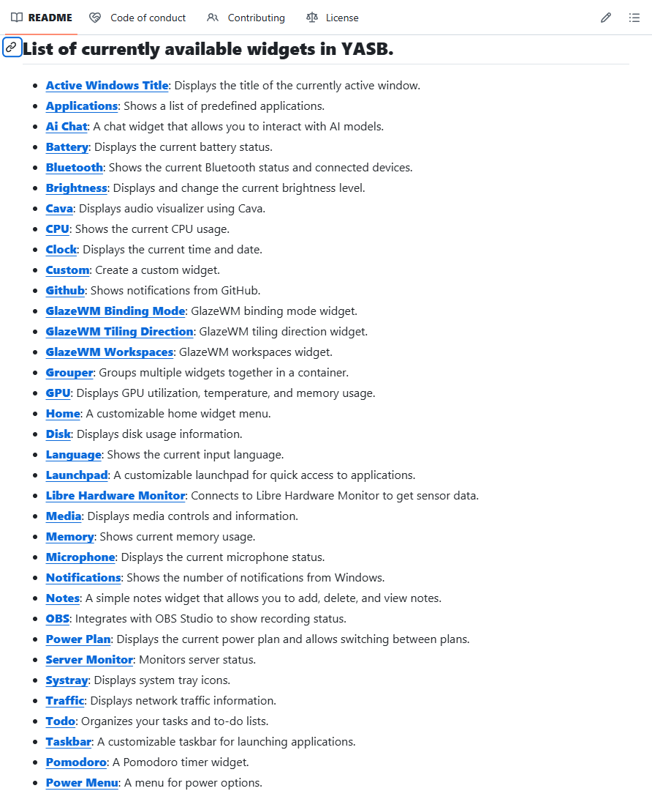
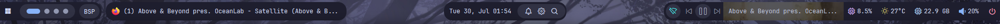
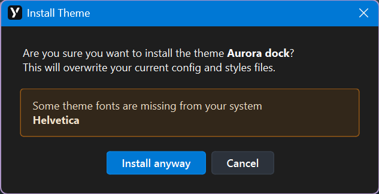
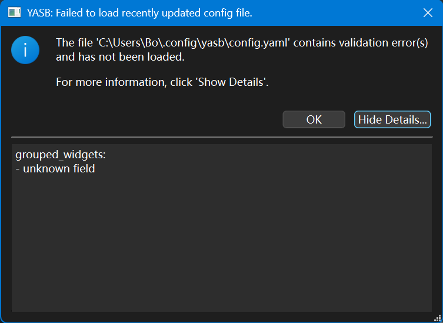
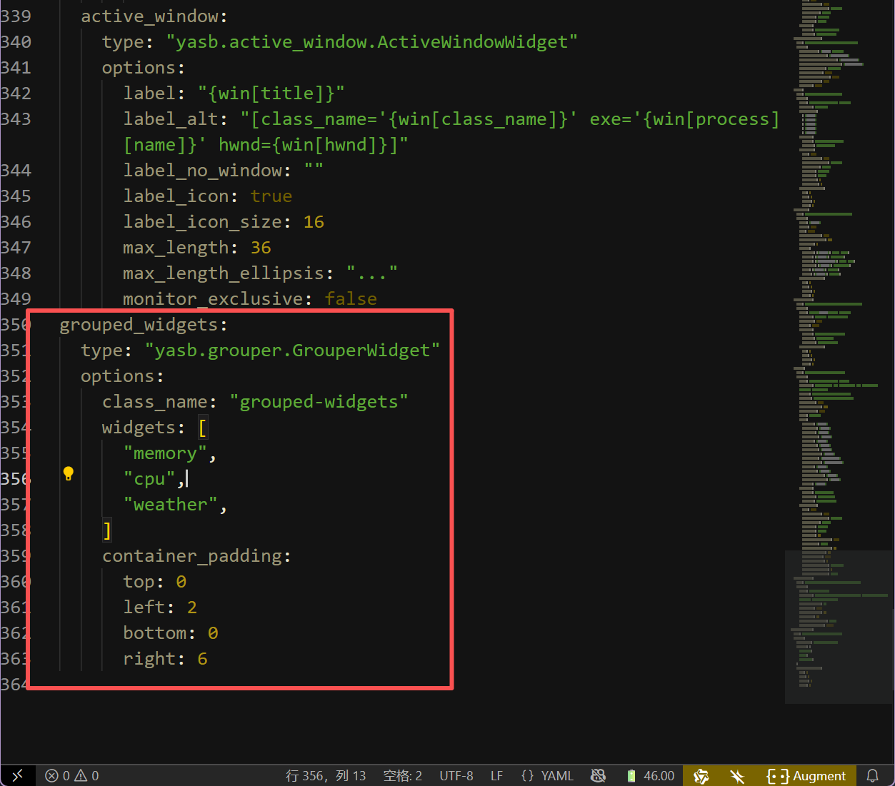
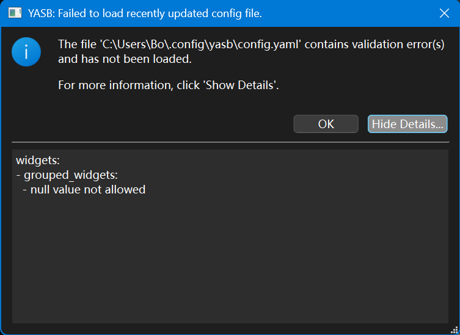
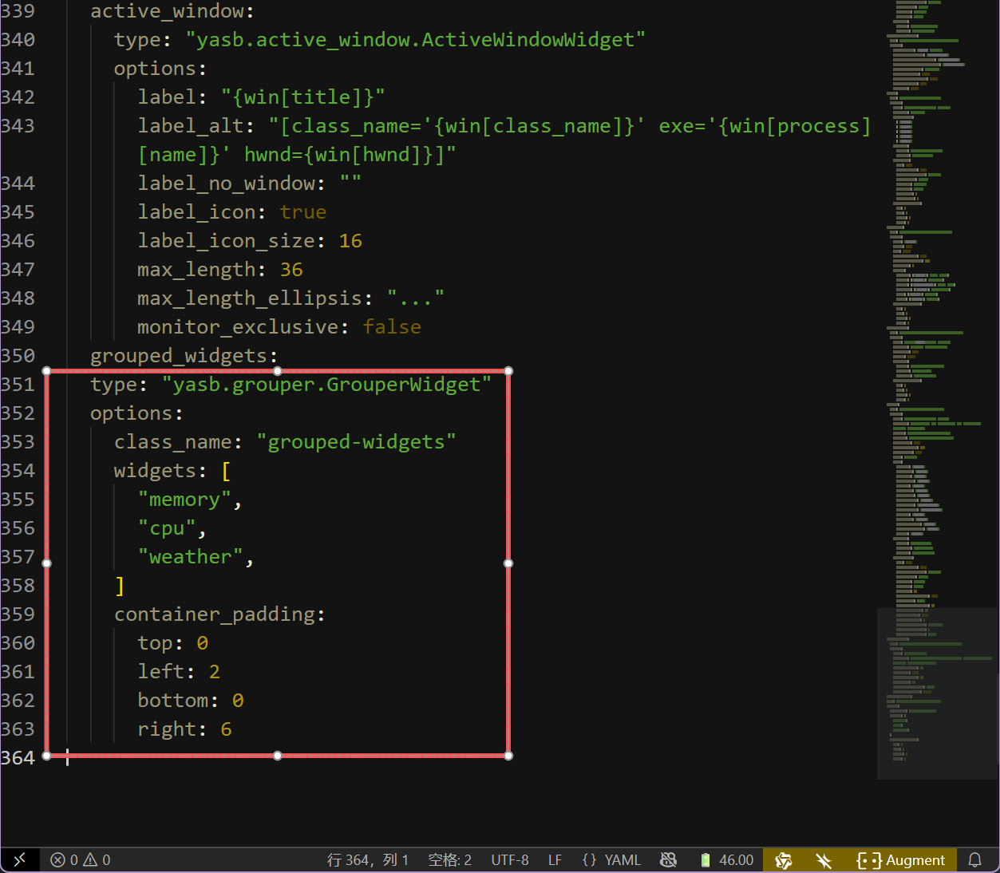

import Callout from '@/components/examples/Callout.astro'
import CodeSimple from 'phosphor-astro/CodeSimple.astro'

# 别再用Windows默认的任务栏了，试试YASB吧

<Callout type="warning" title="Warning" collapsible close>
  _超长文预警！_
</Callout>

先上设置完毕的效果图片吧！


那么想要拥有同款状态栏吗？跟着这份教程就够了，除此之外，希望你可以懂一丢丢 **前端** 的知识，像**css**和**config.yaml**这类的文件可能在之后要用到。

不过不懂也没关系！YASB的作者提供了详细的配置文件供小白使用！后面我也会给出~

首先我想让大家了解什么是YASB，全称为[**Yet Another Status Bar**](https://github.com/amnweb/yasb?tab=readme-ov-file)，中文翻译过来就是**又一个状态栏**，但是我觉得这个小东西的实用价值远超状态栏，不只是因为可以自定义的原因，更多的是它所承载的功能.简直是Windows默认状态栏的好几十倍！

比如说：你可以在[YASB](https://github.com/amnweb/yasb?tab=readme-ov-file)上完成开始菜单的所有功能；还可以设计自己喜欢的**日历**以及**时间**风格；要是想快速了解天气详情也是可以的；查看硬件/网络状态也是可以轻松搞定；当然这样的插件还有差不多40+，你完全可以根据自己的需要添加合适的插件，如果实在没有的话，自己也可以搓一个！这和默认的任务栏相比简直不要太香。



而且全部开源！所见即所得！感谢[YASB](https://github.com/amnweb/yasb?tab=readme-ov-file)的作者[amnweb](https://github.com/amnweb)以及社区成员的无私奉献！

Salute ^ v ^ゞ

由于开发者是英语母语，而且教程也没有中文版本，想一键直达教程可以[点这里](https://github.com/amnweb/yasb?tab=readme-ov-file#installation)。接下来我就用汉化一下如何设置YASB~

## 安装

### 需要的东西

- 字体：Nerd Fonts. 安装 [Nerd Fonts](https://www.nerdfonts.com/font-downloads) (推荐JetBrainsMono，因为如果你后面想要导入别人的主题，这个很方便！)

- 操作系统：Windows 10 & 11

### 安装包

- 从 [GitHub 发布页面](https://github.com/amnweb/yasb/releases/latest)下载最新的安装程序。

- 运行安装程序并按照屏幕上的指示完成安装!

### 其他方式安装

#### Winget

```
winget install --id AmN.yasb
```

#### Scoop

```
scoop bucket add extras
scoop install extras/yasb
```

#### Chocolatey

```
choco install yasb
```

#### Python

- 安装 Python 3.12
- 安装应用程序及其依赖项：
  - `pip install` .（用于常规安装）
  - `pip install -e .[dev]`（用于开发者安装）
- 启动应用程序：
- 在终端中运行 `python src/main.py`（或点击 [yasb.vbs](https://github.com/amnweb/yasb/blob/main/src/yasb.vbs)）
- 按照您的喜好配置 [style.css](https://github.com/amnweb/yasb/blob/main/src/styles.css) 和 [config.yaml](https://github.com/amnweb/yasb/blob/main/src/config.yaml)。

好啦！安装完成你应该可以在桌面的上方看到你的新状态栏啦！是不是和下面的一样，那么接下来我将教你如何自定义你的YASB！



## 自定义

其实自定义你自己的YASB很简单，你只需要这两个文件即可，就是上面提到的`style.css`和`config.yaml`，一个是样式文件，而另一个则是配置文件~

那么我们就先从第二个配置文件开始吧！

### 配置文件-config.yaml

如何找到你的YASB默认配置文件呢？

- 右击YASB托盘图标，点击`Open Config`按钮即可，或者直接在Windows资源管理器输入以下代码也能直达！

```
%USERPROFILE%\.config\yasb
```

- 双击打开即可看见里面的所有配置了，大多数配置不用过度修改，放在那里即可，当然你也可以根据作者的注释进行调整。

这里我给大家讲一下主要可以自定义的几个部分！

- widgets的位置部分

即存放你的widgets的部分代码，你可以通过修改位置来自定义，代码(#40)如下：

```
widgets:
      left:
      - "home"
      - "komorebi_workspaces"
      - "komorebi_active_layout"
      - "active_window"
      center:
      - "clock"
      right:
      - "media"
      - "weather"
      - "microphone"
      - "volume"
      - "notifications"
      - "power_menu"
```

注意！双引号里面就是我前面提到的widgets的名称！可以根据需求自行添加或者删除~

- widgets的功能配置文件

上面说到的只是位置的相关部分，要导入widgets，可以先看下以下格式：

```
  home:
    type: "yasb.home.HomeWidget"
    options:
      label: "<span>\udb81\udf17</span>"
      menu_list:
      - { title: "User Home", path: "~" }
      - { title: "Download", path: "~\\Downloads" }
      - { title: "Documents", path: "~\\Documents" }
      - { title: "Pictures", path: "~\\Pictures" }
      system_menu: true
      power_menu: true
      blur: false
```

不难发现，其实所有的widgets的格式都是这样的，拿上面的home为例，其中`home`既是widget的名称，`type`为统一格式，`options`就是展开后的内容配置了，`\udb81`类似的代码就是图标的样式了（所以你还可以自定义图标哦~）然后下面的其他项都可以自己设置成自己常用的东西啦~

只要你理解这个之后，后面的所有widgets都是如此！

你也可以前往[YASB提供的Widgets](https://github.com/amnweb/yasb?tab=readme-ov-file#list-of-currently-available-widgets-in-yasb)来添加你想要的，做出最~~牛逼~~的状态栏！

### 样式文件-style.css

这个文件和上面的配置文件在一起的，打开你的`styles.css`即可自定义！

（注意！修改此项可能需要一定的前端基础，小白可以直接复制Widgets提供的默认Style即可正常使用！）

如果大佬想要自定义的话可以自己修改布局、颜色、间距、字体等等。如果做出了好看的主题也可以提交到YASB的相关Wiki，开源万岁！

### 安装主题

好了，如果你不喜欢折腾的话，YASB也提供了一些现成的主题。

可以前往YASB的官方Github页面下载

[传送门](https://github.com/amnweb/yasb-themes)

食用方法也和上面两个文件`config.yaml`和`style.css`，只需要把你下载的主题的对应的两个文件复制到前面提到的这个路径即可！

```
%USERPROFILE%\.config\yasb
```

然后重启YASB即可！或者也可以直接右键托盘图标，点击`Get Themes`然后安装你喜欢的主题即可！

值得注意的是有些主题有一些对于字体以及插件的要求，最好看清楚再安装！



## 一些常见的问题

**Q**: 保存config文件之后提示unknown field`，如何解决？



**A**: 这是因为你的config文件某个地方的格式有误，可以参考下方的图片进行缩进的更改来修复！

(下图是错误的格式，注意active-windows和grouped_widgets的区别，需要调整到同一行缩进！)



**Q**: 保存config文件之后提示`null value not allowed`，如何解决？



**A**: 这是也是因为你的config某个地方的格式有误，可以参考下方的图片进行缩进的更改来修复！

(和上面一样，注意type的缩进！要在grouped_widgets的下一级！)



更多问题可以前往 [issues](https://github.com/amnweb/yasb/issues) 进行反馈！和查找解决方案！也欢迎在该博客下方留言！有空会回复！(●'◡'●)

好了，这就是我对于YASB的全部理解！希望本篇指南有帮助到你！也欢迎在评论区秀出你自己的配置！下面就贴两个我自己的配置吧！有需要的朋友可以自取！不过天气的API要自己去获取哦，怕别人狂刷我的API ಥ_ಥ

## 我的配置

### config.yaml

<details>
<summary><CodeSimple width={20} height={20} /> 点击查看/折叠代码块</summary>

```
    watch_stylesheet: true
    watch_config: true
    debug: false
    bars:
    primary-bar:
        enabled: true
        screens: ['*']
        class_name: "yasb-bar"
        alignment:
        position: "top"
        center: false
        blur_effect:
        enabled: false
        acrylic: false
        dark_mode: true
        round_corners: false
        border_color: None
        window_flags:
        always_on_top: true
        windows_app_bar: true
        hide_on_fullscreen: true
        dimensions:
        width: "100%"
        height: 30
        padding:
        top: 0 # 4 4 2 4
        left: 0
        bottom: 0
        right: 0
        widgets:
        left:
            [
            "home",
            "active_window",
            "media"
            ]
        center:
            [
            "clock",
            "weather"
            ]
        right:
            [
            "obs",
            "launchpad",
            "sysinfo_widgets",
            "notifications",
            "update_check",
            "volumesound",
            "github",
            "power_menu"
            ]
    widgets:
    home:
        type: "yasb.home.HomeWidget"
        options:
        label: "<span>\ue893</span>"
        menu_list:
        - { title: "Home", path: "~" }
        - { title: "Downloads", path: "D:/f/Download"}
        - { title: "Documents", path: "D:/f/Documents"}
        - { title: "Pictures", path: "D:/f/Pictures"}
        - { title: "Videos", path: "D:/f/Videos"}
        - { title: "iSumsoft", path: "D:/f/Documents/iSumsoft_Web_3"}
        - { title: "PARA Notes", path: "D:/f/Documents/Github/Junbo-PARA-Notes"}
        system_menu: true
        power_menu: false
        blur: true
        round_corners: true
        round_corners_type: "small"
        border_color: "system"
        distance: 5
        container_padding:
            top: 0
            left: 0
            bottom: 0
            right: 0
        alignment: "left"
        direction: "down"
        menu_labels:
            shutdown: "Shutdown"
            restart: "Restart"
            logout: "Logout"
            lock: "Lock"
            sleep: "Sleep"
            system: "System Settings"
            about: "About This PC"
            task_manager: "Task Manager"
    weather:
        type: "yasb.weather.WeatherWidget"
        options:
        label: "<span>{icon}</span> {temp} - {location}"
        label_alt: "{location}: {conditions}, Min {min_temp}, Max {max_temp}, Humidity {humidity}"
        api_key: "YOUR WEATHER API KEY" # Get your free API key from https://www.weatherapi.com/
        update_interval: 600
        hide_decimal: true
        location: "China, Shenzhen" # You can use "USA Los Angeles 90006" {COUNTRY CITY ZIP_CODE}, or just city.
        units: "metric" # Can be 'metric' or 'imperial'
        callbacks:
            on_left: "toggle_card"
        icons:
            sunnyDay: "\udb81\udd99"
            clearNight: "\ue3c2"
            cloudyDay: "\ue21d"
            cloudyNight: "\ue226"
            rainyDay: "\ue371"
            rainyNight: "\ue371"
            snowyIcyDay: "\udb81\udf17"
            snowyIcyNight: "\udb81\udf17"
            blizzardDay: "\udb81\udd99"
            default: "\udb81\udd99"
        weather_card:
            show_hourly_forecast: true
            blur: true
            round_corners: true
            round_corners_type: "small"
            border_color: "system"
            alignment: "center"
            direction: "down"
            offset_top: 6
            icon_size: 48
    media:
        type: "yasb.media.MediaWidget"
        options:
        label: "<span>\udb80\udf87</span> {title}"
        label_alt: "<span>\udb80\udf87</span> {title}"
        hide_empty: true
        callbacks:
        on_left: "toggle_media_menu"
        on_middle: "do_nothing"
        on_right: "toggle_label"
        max_field_size:
            label: 55
            label_alt: 80
        show_thumbnail: true
        controls_only: false
        controls_left: true
        thumbnail_alpha: 80
        thumbnail_padding: 0
        thumbnail_corner_radius: 8
        thumbnail_edge_fade: true
        scrolling_label:
            enabled: false
            update_interval_ms: 100
            style: "left"  # can be "left", "right", "bounce", "bounce-ease"
            separator: " | "
            label_padding: 0
            # Easing curve params: https://www.desmos.com/calculator/j7eamemxzi
            ease_slope: 20
            ease_pos: 0.8
            ease_min: 0.5
        icons:
            prev_track: "\uf048"
            next_track: "\uf051"
            play: "\uf04b"
            pause: "\uf04c"
        media_menu:
        blur: true
        round_corners: true
        round_corners_type: "small"
        border_color: "system"
        alignment: "right"
        direction: "down"
        offset_top: 6
        offset_left: 0
        thumbnail_corner_radius: 4
        thumbnail_size: 80
        max_title_size: 80
        max_artist_size: 20
        show_source: true
        media_menu_icons:
        play: "\uf04b"
        pause: "\uf04c"
        prev_track: "\uf048"
        next_track: "\uf051"
        label_shadow:
        enabled: true
        color: "black"
        radius: 3
        offset: [ 1, 1 ]
    active_window:
        type: "yasb.active_window.ActiveWindowWidget"
        options:
        label: "{win[title]}"
        label_alt: "[class_name='{win[class_name]}' exe='{win[process][name]}' hwnd={win[hwnd]}]"
        label_no_window: ""
        label_icon: true
        label_icon_size: 14
        max_length: 50
        max_length_ellipsis: "..."
        monitor_exclusive: true
    clock:
        type: "yasb.clock.ClockWidget"
        options:
        label: "{%a, %d %b - %H:%M}"
        label_alt: "{%A, %d %B %Y - %H:%M}"
        timezones: []
        update_interval: 1000
        calendar:
            alignment: "center"
            blur: True
            round_corners: True
            round_corners_type: "small"
            border_color: "System"
            direction: "down"
            show_holidays: true
            show_week_numbers: False
            holiday_color: "#ff9f00"
        callbacks:
            on_left: "toggle_calendar"
            on_middle: "do_nothing"
            on_right: "toggle_label"
    disk:
        type: "yasb.disk.DiskWidget"
        options:
            label: "<span>\uf473</span>"
            label_alt: "<span>\uf473</span>"
            update_interval: 60
            group_label:
            volume_labels: ["C", "D", "E", "F"]
            show_label_name: false
            blur: True
            round_corners: True
            round_corners_type: "small"
            border_color: "System"
            alignment: "right"
            direction: "down"
            callbacks:
            on_left: "toggle_group"
            on_middle: "toggle_label"
            on_right: "exec explorer" # Open disk C in file explorer
    power_menu:
        type: "yasb.power_menu.PowerMenuWidget"
        options:
            label: "\uf011"
            uptime: True
            blur: False
            blur_background: True
            animation_duration: 250 # Milisecond
            button_row: 5 # Number of buttons in row, min 1 max 5
            buttons:
            signout: ["\udb80\udf43","Sign out"]
            shutdown: ["\uf011","Shut Down"]
            restart: ["\uead2","Restart"]
            hibernate: ["\uf28e","Hibernate"]
            cancel: ["\udb81\udf3a","Cancel"]
    notifications:
        type: "yasb.notifications.NotificationsWidget"
        options:
        label: "<span>\uf476</span> {count}"
        label_alt: "{count} notifications"
        hide_empty: true
        tooltip: true
        callbacks:
            on_left: "toggle_notification"
            on_right: "toggle_label"
            on_middle: "do_nothing"
    cpu:
        type: "yasb.cpu.CpuWidget"
        options:
        label: "<span>\uf4bc</span> {info[percent][total]}%"
        label_alt: "<span>\uf437</span> {info[histograms][cpu_percent]}"
        update_interval: 2000
        histogram_icons:
            - "\u2581" # 0%
            - "\u2581" # 10%
            - "\u2582" # 20%
            - "\u2583" # 30%
            - "\u2584" # 40%
            - "\u2585" # 50%
            - "\u2586" # 60%
            - "\u2587" # 70%
            - "\u2588" # 80%+
        histogram_num_columns: 8
        callbacks:
            on_right: "exec cmd /c Taskmgr"
        container_padding:
            top: 0
            left: 0
            bottom: 0
            right: 0
    memory:
        type: "yasb.memory.MemoryWidget"
        options:
        label: "<span>\uefc5</span> {virtual_mem_percent}%"
        label_alt: "<span>\uefc5</span> {virtual_mem_used}/{virtual_mem_total}"
        update_interval: 2000
        callbacks:
            on_left: "toggle_label"
            on_middle: "do_nothing"
            on_right: "do_nothing"
        container_padding:
            top: 0
            left: 0
            bottom: 0
            right: 8
    volumesound:
        type: "yasb.volume.VolumeWidget"
        options:
        label: "<span>{icon}</span> {level}"
        label_alt: "{volume}"
        volume_icons:
            - "\ueee8"  # Icon for muted
            - "\uf026"  # Icon for 0-10% volume
            - "\uf027"  # Icon for 11-30% volume
            - "\uf027"  # Icon for 31-60% volume
            - "\uf028"  # Icon for 61-100% volume
        audio_menu:
            blur: True
            round_corners: True
            round_corners_type: "small"
            border_color: "System"
            alignment: "right"
            direction: "down"
            offset_top: 6
            offset_left: 80
        callbacks:
            on_left: "toggle_volume_menu"
            on_middle: "exec cmd.exe /c start ms-settings:sound"
            on_right: "toggle_mute"
        label_shadow:
            enabled: true
            color: "black"
            radius: 6
            offset: [ 1, 1 ]
    update_check:
        type: "yasb.update_check.UpdateCheckWidget"
        options:
        winget_update:
            enabled: true
            label: "<span>\uf0ab</span>{count}"
            interval: 360
            exclude: [Discord]
        windows_update:
            enabled: false
            label: "<span>\uf0ab</span>{count}"
            interval: 360
            exclude: []
    traffic:
        type: "yasb.traffic.TrafficWidget"
        options:
        label: "  {today_downloaded}  |  {today_uploaded}  "
        label_alt: "<span>\udb82\udcfa</span> Download {download_speed} | Upload {upload_speed}"
        update_interval: 1000
        speed_unit: "bytes"
        menu:
            blur: true
            round_corners: true
            round_corners_type: "small"
            border_color: "system"
            alignment: "left"
            direction: "down"
            offset_top: 6
            offset_left: 0
            show_internet_info: true
            show_interface_name: true
        callbacks:
            on_left: "toggle_menu"
            on_right: "exec cmd.exe /c start ms-settings:network"

    microphone:
        type: "yasb.microphone.MicrophoneWidget"
        options:
        label: "<span>{icon}</span>"
        label_alt: "<span>{icon}</span> {level}"
        icons:
            normal: ""
            muted: ""
        callbacks:
            on_left: "toggle_mic_menu"
            on_middle: "exec cmd.exe /c start ms-settings:sound"
            on_right: "toggle_mute"
        mic_menu:
            blur: True
            round_corners: True
            round_corners_type: "small"
            border_color: "System"
            alignment: "right"
            direction: "down"
            offset_top: 6
            offset_left: 0
    wifi:
        type: "yasb.wifi.WifiWidget"
        options:
            label: "\ueb01"
            label_alt: "{wifi_name} {wifi_strength}%"
            update_interval: 5000
            callbacks:
            on_left: "exec quick_settings"
            on_middle: "toggle_label"
            on_right: "exec cmd.exe /c start ms-settings:network"
            ethernet_label: "\ueb01"
            ethernet_label_alt: "\ueb01 {ip_addr}"
            ethernet_icon: "\ueba9"
    sysinfo_widgets:
        type: "yasb.grouper.GrouperWidget"
        options:
        class_name: "sysinfo-grouped-widgets"
        widgets: [
            "traffic",
            "cpu",
            "memory",
            "disk",
        ]
        container_padding:
            top: 0
            left: 2
            bottom: 0
            right: 2
    launchpad:
        type: "yasb.launchpad.LaunchpadWidget"
        options:
        label: "<span>\udb85\udcde</span>"
        search_placeholder: "Search apps..."
        app_icon_size: 48
        window:
            fullscreen: false
            width: 800
            height: 600
            overlay_block: true
        window_style:
            enable_blur: true
            round_corners: true
            round_corners_type: "normal"
            border_color: "system"
        window_animation:
            fade_in_duration: 200
            fade_out_duration: 200
        callbacks:
            on_left: "toggle_launchpad"
        app_title_shadow:
            enabled: true
            color: "#00000090"
            offset: [1, 1]
            radius: 2
        app_icon_shadow:
            enabled: true
            color: "#00000090"
            offset: [0, 2]
            radius: 8
    obs:
        type: "yasb.obs.ObsWidget"
        options:
        connection:
            host: "192.168.1.125"
            port: 4455
            password: "YOUR OBS PASSWORD"
        icons:
            recording: "\ueba7"
            stopped: "\ueba5"
            paused: "\ueba7"
        hide_when_not_recording: true
        blinking_icon: true
    github:
        type: "yasb.github.GithubWidget"
        options:
        label: "<span>\ueba1</span>"
        label_alt: "Notifications {data}" # {data} return number of unread notification
        token: YOUR GIT HUB TOKEN # GitHub Personal access tokens (classic) https://github.com/settings/tokens
        max_notification: 20 # Max number of notification displaying in menu max: 50
        notification_dot:
            enabled: True
            corner: "bottom_left" # Can be "top_left", "top_right", "bottom_left", "bottom_right"
            color: "red" # Can be hex color or string
            margin: [ 1, 1 ] # x and y margin for the dot
        only_unread: false # Show only unread or all notifications;
        max_field_size: 54 # Max characters in title before truncation.
        update_interval: 300 # Check for new notification in seconds
        menu:
            blur: True # Enable blur effect for the menu
            round_corners: True # Enable round corners for the menu (this option is not supported on Windows 10)
            round_corners_type: "normal" # Set the type of round corners for the menu (normal, small) (this option is not supported on Windows 10)
            border_color: "System" # Set the border color for the menu (this option is not supported on Windows 10)
            alignment: "right"
            direction: "down"
        label_shadow:
            enabled: True
            color: "black"
            radius: 3
            offset: [ 1, 1 ]
```

</details>

### style.css

<details>
<summary><CodeSimple width={20} height={20} /> 点击查看/折叠代码块</summary>

```
    /* THEME FONT & COLOR VARIABLES */
    :root {
        --accent: #fcf75e; /*Weather, Calendar, Notifications & Updates Icons*/
        --menu_bg: rgba(30, 30, 46, 0.6);
        --menu_bg2: rgba(30, 30, 46, 0.4);
        --update: #673147;
        --update_border: #74c7ec;
        --red: #FF534D; /*Power Button, Net Disconnect*/
        --media: #ff9f00;
        --traffic: #4cbb17;
        --disks: #2196F3;
        --text: #cdd6f4;
        --subtext: #a6adc8;
        --subtext1: #ded6f4;
        --subtext2: #afb5cc;
        --bg: #111111;
        --bg_alpha: rgba(30, 30, 46, 0.85);
        --hourlyweather_bg:rgba(21, 93, 199, 0.85);
        --hover: rgba(255, 255, 255, 0.05);
        --font: 'Roboto';
        --font-size: 12px; /* Applies to most of the theme */
    }

    /* MAIN */

    *{
        font-size: var(--font-size);
        color: var(--text);
        font-weight: bold;
        font-family: "JetBrainsMono NFP"; /* Needed for icons */
        margin: 0;
        padding: 0;
    }
    .yasb-bar {
        padding: 0;
        margin: 0;
        background-color: var(--bg_alpha);
    }
    .widget {
        padding: 0 4px;
        margin: 0 4px;
        border-radius: 12px;
        border: 1px solid rgba(128, 128, 128, 0);
    }
    .widget .icon {
        font-size: 13px;
    }
    .widget .label {
        color: var(--text);
    }

    /* HOME */

    .home-widget {
        padding-bottom: 1px;
    }
    .home-widget .icon {
        color: var(--text);
        font-size: 18px;
    }
    .home-widget .icon:hover {
        color: var(--accent);
    }

    /* HOME DROPDOWN */

    .home-menu {
        background-color: var(--menu_bg);
        padding: 0;
        margin-left: 0px;
    }
    .home-menu .menu-item {
        padding: 6px 48px 7px 16px;
        font-size: var(--font-size);
        font-family: var(--font);
    }
    .home-menu .menu-item:hover {
        background-color: var(--hover);
        border: 1px solid rgba(255, 255, 255, 0.1);
        color: #fff;
    }
    .home-menu .separator {
        max-height: 1px;
        background-color:rgba(128, 130, 158, 0.3);
    }

    /* WEATHER */

    .weather-widget {
        padding: 0;
        padding-left: -5
    }
    .weather-widget .icon {
        color: var(--accent);
        font-size: 14px;
        padding: 6px;
    }
    .weather-widget .label {
        font-size: var(--font-size);
        font-family: var(--font);
        color: var(--accent);
    }

    /* WEATHER DROPDOWN */

    .weather-card {
        background-color: var(--menu_bg);
    }
    .weather-card-today {
        border-bottom: 1px solid rgba(255, 255, 255, 0.2);
        border-radius: 4px;
        background-color:  var(--menu_bg2);
    }
    .weather-card-today .label {
        font-size: 13px;
        font-family: var(--font);
    }
    .weather-card-today .label.location {
        font-family: var(--font);
        font-size: 22px;
        color: var(--accent);
    }
    .weather-card-today .label.alert {
        font-family: var(--font);
        font-size: var(--font-size);
        background-color: var(--menu_bg2);
        border-bottom: 1px solid rgba(255, 255, 255, 0.2);
        color: rgba(196, 181, 162, 0.85);
        border-radius: 4px;
        padding: 5px 0;
    }
    .weather-card-day {
        border-bottom: 1px solid rgba(255, 255, 255, 0.2);
        border-radius: 4px;
        background-color:  var(--menu_bg2);
    }
    .weather-card-day.active {
        background-color: var(--menu_bg2);
        border-bottom: 1px solid rgba(255, 255, 255, 0.2);
    }
    .weather-card-day:hover {
        background-color: var(--hover);
        border: 1px solid rgba(255, 255, 255, 0.1);
    }
    .weather-card-day .label {
        font-size: 13px;
        font-family: var(--font);
    }
    .weather-card .hourly-container {
        border-bottom: 1px solid rgba(255, 255, 255, 0.2);
        background-color: var(--hourlyweather_bg);
        border-radius: 4px;
        min-height: 150px;
    }
    .weather-card .hourly-data {
        font-family: var(--font);
        background-color: #FAE93F; /* Curve color */
        font-size: 12px;
    }

    /* ACTIVE WINDOW */

    .active-window-widget .label {
        font-size: var(--font-size);
        font-family: var(--font);
    }
    .active-window-widget .icon {
        padding-right: 6px;
        border: none;
    }

    /*CLOCK WIDGET*/

    .clock-widget .label {
        font-size: var(--font-size);
        font-family: var(--font);
    }

    /*CALENDAR DROPDOWN*/

    .calendar {
        background-color: var(--menu_bg);
    }
    .calendar .calendar-table{
        border-radius: 4px;
        background-color: var(--menu_bg2);
    }
    .calendar .calendar-table,
    .calendar .calendar-table::item {
        color: var(--subtext);
        font-family: var(--font);
        font-size: var(--font-size);
        margin: 0;
        padding: 0;
        border: none;
        outline: none;
        border-bottom: 1px solid rgba(255, 255, 255, 0.2);
    }
    .calendar .calendar-table::item:selected {
        color: var(--accent);
    }
    .calendar .day-label {
        margin-top: 20px;
    }
    .calendar .day-label,
    .calendar .month-label,
    .calendar .date-label {
        font-family: var(--font);
        font-size: 14px;
        color: #fff;
        font-weight: 600;
        min-width: 180px;
        max-width: 180px;
    }
    .calendar .month-label {
        font-weight: 700;
    }
    .calendar .date-label {
        font-size: 80px;
        font-weight: 900;
        color: rgb(255, 255, 255);
        margin-top: -5px;
        color: var(--accent);
    }
    .calendar .week-label,
    .calendar .holiday-label {
        font-family: var(--font);
        font-size: 12px;
        color: var(--media);
        font-weight: 700;
        min-width: 180px;
        max-width: 180px;
    }

    /* DISK WIDGET */

    .disk-widget {
        padding: 0 0px 0 0px;
    }
    .disk-widget .icon {
        padding: 0px;
        color: var(--text);
        font-size: 13px;
    }

    /* DISK DROPDOWN */

    .disk-group {
        background-color: var(--menu_bg);
    }
    .disk-group-row {
        min-width: 220px;
        max-width: 220px;
        max-height: 40px;
        margin: 0;
        padding: 0;
        border-radius: 6px;
        border: 1px solid rgba(128, 128, 128, 0);
    }
    .disk-group-row:hover {
        background-color: var(--hover);
        border: 1px solid rgba(255, 255, 255, 0.1);
    }
    .disk-group-label-bar{
        max-height: 8px;
        border:0px solid rgba(128, 128, 128, 0);
        background-color: rgba(148, 226, 213, 0.3);
        border-radius: 4px;
    }
    .disk-group-label-bar::chunk{
        background-color: var(--disks);
        border-radius: 4px;
    }
    .disk-group-label {
        font-size: var(--font-size);
    }
    .disk-group-label-size {
        font-size: var(--font-size);
        color: rgba(205, 214, 244, 0.5);
    }

    /* AUDIO & MIC WIDGET */

    .volume-widget {
        margin-left: 0;
        padding: 0;
    }
    .volume-widget .icon {
        padding: 0 5px;
        color: white;
        font-size: 13px;
    }
    .volume-widget .label {
        font-size: var(--font-size);
        font-family: var(--font);
    }

    .microphone-widget .icon {
        color: white;
        font-size: 12px;
    }

    /* AUDIO & MIC DROPDOWN */

    .audio-menu {
        background-color: var(--menu_bg);
    }
    .microphone-menu{
        background-color: var(--menu_bg);
    }
    .audio-container .device {
        font-family: var(--font);
        background-color: transparent;
        border: none;
        padding:6px 8px 6px 4px;
        margin: 2px 0;
        font-size: var(--font-size);
        border-radius: 4px;
    }
    .audio-container .device.selected {
        background-color: rgba(255, 255, 255, 0.085);
    }
    .audio-container .device:hover {
        background-color: var(--hover);
        border: 1px solid rgba(255, 255, 255, 0.1);
    }

    /* POWER */

    .power-menu-widget {
        padding-left: 6px;
    }
    .power-menu-widget .label {
        color: var(--red);
        font-size: 16px;
    }

    /* POWER MENU */

    .uptime {
        font-size: 16px;
        margin-bottom: 10px;
        color: var(--accent);
        font-weight: 600;
        font-family: var(--font);
    }
    .power-menu-popup .button {
        padding: 0;
        width: 160px;
        height: 240px;
        border-radius: 6px;
        background-color: var(--bg_alpha);
        font-family: var(--font);
        color: white;
        border: 4px solid rgba(255, 255, 255, 0);
    }
    .power-menu-popup .button.hover {
        background-color: var(--hover);
        border: 1px solid rgba(255, 255, 255, 0.1);
    }
    .power-menu-popup .button .label {
        margin-bottom: 8px;
        font-size: 16px;
        font-weight: 600;
        color: rgba(255, 255, 255, 0.6);
        font-family: var(--font);
    }
    .power-menu-popup .button .icon {
        font-size: 64px;
        padding-top: 54px;
        color: rgba(255, 255, 255, 0.25);
    }
    .power-menu-popup .button.cancel .icon {
        color: rgba(243, 139, 168, 0.55);
    }
    .power-menu-popup .button.cancel .label {
        color: rgba(243, 139, 168, 0.95);
        color: rgba(243, 139, 168, 0.95);
    }

    /*NOTIFICATIONS*/

    .notification-widget .icon {
        font-size: 13px;
        color: var(--accent);
    }
    .notification-widget .label {
        color: var(--text);
        background-color: var(--red);
        border-radius: 6px;
        padding: 1px 4px;
        font: 8px Verdana;
        font-weight: 800;
        margin: 5px 0 8px 0;
        position: absolute;
        top: 0;
        right: 0;
    }

    /* MEDIA */
    .media-widget .widget-container
    {
        background-color: transparent;
        margin: 0px 0 0px 0;
        border-radius: 4px;
    }
    .media-widget {
        padding: 0;
        margin: 0;
        border-radius: 0;
    }
    .media-widget .label {
        font-family: var(--font);
        font-size: var(--font-size);
        padding: 0 0px;
        color: var(--media);
        padding: 0px;
        padding-left: 12px;
    }
    .media-widget .btn {
        color: var(--media);
        padding:0 1px;
        margin: 0;
        font-size: 12px;
        background: rgba(0, 0, 0, 0.01);
    }
    .media-widget .icon{
        padding: 0 6px;
    }
    .media-widget .btn:hover {
        color: var(--text);
    }
    .media-widget .btn.play {
        font-size: 17px;
        max-width: 22px;
        min-width: 22px;
    }
    .media-widget .btn.disabled:hover,
    .media-widget .btn.disabled {
        color: #585b70;
    }

    /* MEDIA DROPDOWN */

    .media-menu {
        min-width: 420px;
        max-width: 420px;
        background-color: var(--menu_bg);
    }
    .media-menu .source {
        font-size: 12px;
        margin-left: 10px;
        color: #000;
        border-radius: 3px;
        background-color: var(--bg);
        padding: 2px 4px;
    }
    .media-menu .title{
        font-family: var(--font);
        margin-left: 10px;
        font-size: 14px;
    }
    .media-menu .artist {
        font-family: var(--font);
        font-size: var(--font-size);
        color: var(--media);
        margin-top: 0px;
        margin-bottom: 8px;
        margin-left: 12px;
    }
    .media-menu .btn {
        font-size: 13px;
        font-weight: 400;
        margin: 10px 2px 0px 2px;
        min-width: 40px;
        max-width: 40px;
        min-height: 40px;
        max-height: 40px;
        border-radius: 20px;
    }
    .media-menu .btn.prev {
        margin-left: 50px;
    }
    .media-menu .btn:hover {
        color: var(--media);
    }
    .media-menu .btn.play {
        font-size: 24px;
    }
    .media-menu .btn.disabled:hover,
    .media-menu .btn.disabled {
        color: var(--subtext2);
    }
    .media-menu .playback-time {
        font-family: var(--font);
        font-size: 13px;
        color: var(--subtext1);
        margin-top: 20px;
        min-width: 100px;
    }
    .media-menu .progress-slider {
        height: 10px;
        margin: 5px 4px;
        border-radius: 3px;
        color: var(--media);
    }
    .media-menu .progress-slider::groove {
        background: transparent;
        height: 2px;
        border-radius: 3px;
        background: rgba(255, 255, 255, 0.1);
    }
    .media-menu .progress-slider::groove:hover {
        background: transparent;
        height: 6px;
        border-radius: 3px;
        background: rgba(255, 255, 255, 0.2);
    }
    .media-menu .progress-slider::sub-page {
        background: var(--media);
        border-radius: 3px;
        height: 4px;
    }

    /* CPU & MEMORY */

    .cpu-widget {
        padding-right: 0;
    }
    .memory-widget {
        padding-left: 0;
    }
    .cpu-widget .widget-container {
        border-bottom-right-radius: 0;
        border-top-right-radius: 0;
    }
    .memory-widget .widget-container {
        border-bottom-left-radius: 0;
        border-top-left-radius: 0;
    }
    .memory-widget .label {
        font-family: var(--font);
        min-width: 30px;
        max-width: 80px;
        color: var(--text);
        font-size: var(--font-size);
        padding: 0;
    }
    .cpu-widget .label {
        font-family: var(--font);
        min-width: 30px;
        max-width: 80px;
        color: var(--text);
        font-size: var(--font-size);
        padding: 0;
    }
    .cpu-widget .icon {
        color: var(--text);
        margin-right: 4px;
        font-size: 13px;
    }
    .memory-widget .icon {
        color: var(--text);
        margin-right: 4px;
        font-size: 13px;
    }

    /* UPDATES */

    .update-check-widget {
        padding: 0 0px 0 0px;
    }
    .update-check-widget .icon {
        font-size: 14px;
        color: var(--accent);
    }
    .update-check-widget .widget-container.winget,
    .update-check-widget .widget-container.windows {
        background: var(--bg_alpha);
        margin: 1px 0px 2px 0px;
        border-radius: 4px;
        border: 0px solid var(--update_border);
    }
    .update-check-widget .widget-container.winget .icon,
    .update-check-widget .widget-container.windows .icon {
        color: var(--accent);
        margin: 0 2px 0 6px;
    }
    .update-check-widget .widget-container.winget .label,
    .update-check-widget .widget-container.windows .label {
        color: var(--text);
        background-color: var(--red);
        border-radius: 6px;
        padding: 1px 4px;
        font: 8px Verdana;
        font-weight: 800;
        margin: 5px 0 8px 0;
        position: absolute;
        top: 0;
        right: 0;
    }

    /* TRAFFIC */

    .traffic-widget .icon {
        color: var(--traffic);
        padding-right: 0px;
        padding-left: 0px;
        font-size: 13px;
    }
    .traffic-widget .label {
        font-family: var(--font);
        font-size: var(--font-size);
        text-align: right;
        float: right;
        color: var(--traffic);
        min-width: 100px;
        max-width: 190px;
    }

    /* TRAFFIC DROPDOWN */

    .traffic-menu {
        background-color: var(--menu_bg);
        min-width: 280px;
    }
    .traffic-menu .header {
        border-bottom: 1px solid rgba(255, 255, 255, 0.1);
        background-color: var(--menu_bg2);
    }
    .traffic-menu .header .title {
        padding: 8px;
        font-size: 14px;
        font-weight: 600;
        font-family: var(--font);
        color: var(--accent);
    }
    .traffic-menu .header .reset-button {
        font-size: var(--font-size);
        padding: 4px 8px;
        margin-right: 8px;
        font-family: var(--font);
        border-radius: 4px;
        background-color: transparent;
        border: none;
    }
    .traffic-menu .reset-button:hover {
        color: #ffffff;
        background-color: var(--hover);
        border: 1px solid rgba(255, 255, 255, 0.1);
    }
    .traffic-menu .reset-button:pressed {
        color: #ffffff;
        background-color: rgba(255, 255, 255, 0.1);
        border: 1px solid rgba(255, 255, 255, 0.2);
    }

    /* TRAFFIC DROPDOWN SPEEDS & DATA */

    .traffic-menu .download-speed,
    .traffic-menu .upload-speed {
        background-color: var(--menu_bg2);
        padding: 4px 10px;
        margin-right: 12px;
        margin-left: 12px;
        margin-top: 16px;
        margin-bottom: 0;
        border-radius: 4px;
        border-bottom: 1px solid rgba(255, 255, 255, 0.2);
    }
    .traffic-menu .download-speed {
        margin-left: 12px;
        margin-right: 12px;
    }
    .traffic-menu .speed-separator {
        max-width: 1px;
        background-color: rgba(255, 255, 255, 0.2);
        margin: 32px 0 16px 0;
    }
    .traffic-menu .upload-speed-value,
    .traffic-menu .download-speed-value {
        font-size: 22px;
        font-weight: 900;
        font-family: var(--font);
        color: #bcc2c5;
    }
    .traffic-menu .upload-speed-unit,
    .traffic-menu .download-speed-unit {
        font-size: var(--font-size);
        font-family: var(--font);
        padding-top: 4px;
    }
    .traffic-menu .upload-speed-placeholder,
    .traffic-menu .download-speed-placeholder {
        color: #747474;
        font-size: var(--font-size);
        font-family: var(--font);
        padding: 0 0 4px 0;
    }
    .traffic-menu .section-title {
        font-size: 13px;
        font-weight: 600;
        color: var(--subtext1);
        margin-bottom: 4px;
        font-family: var(--font);
    }
    .traffic-menu .session-section,
    .traffic-menu .today-section,
    .traffic-menu .alltime-section {
        margin: 8px 8px 0 8px;
        padding: 0 10px 10px 10px;
        background-color: transparent;
        border-bottom: 1px solid rgba(255, 255, 255, 0.1);
    }
    .traffic-menu .data-text {
        font-size: var(--font-size);
        color: var(--subtext2);
        padding: 2px 0;
        font-family: var(--font);
    }
    .traffic-menu .data-value {
        font-size: var(--font-size);
        font-family: var(--font);
        padding: 2px 0;
    }

    /* TRAFFIC FOOTER */

    .traffic-menu .interface-info,
    .traffic-menu .internet-info {
        font-size: 12px;
        color: var(--subtext2);
        padding: 8px 0;
        font-family: var(--font);
    }
    .traffic-menu .internet-info {
        background-color: var(--menu_bg2);
    }
    .traffic-menu .internet-info.connected {
        background-color: var(--menu_bg2);
        color: var(--traffic);
    }
    .traffic-menu .internet-info.disconnected {
        background-color: var(--menu_bg2);
        color: var(--red);
    }

    /* NETWORK */

    .wifi-widget .icon{
        font-size: 13px;
        font-align: right;
        color: var(--text);
    }
    .wifi-widget .label{
        font-size: 15px;
        font-align: right;
        color: var(--text);
    }

    /* NETWORK DROPDOWN */

    .wifi-menu {
        font-family: var(--font);
        background-color: rgba(17, 17, 27, 0.4);
        max-height: 350px;
        min-height: 375px;
        min-width: 375px;
    }
    .wifi-menu .progress-bar {
        max-height: 2px;
    }
    .wifi-menu .progress-bar::chunk {
        background-color: #4cc2ff;
    }
    .wifi-menu .header {
        font-family: var(--font);
        font-size: 12px;
        font-weight: 600;
        margin-bottom: 2px;
        padding: 12px;
        background-color: rgba(17, 17, 27, 0.6);
        color: white;
        border-bottom: 1px solid rgba(255, 255, 255, 0.1);
    }
    .wifi-menu .error-message {
        font-family: var(--font);
        font-size: 12px;
        font-weight: 600;
        margin-bottom: 2px;
        padding: 12px;
        background-color: red;
        color: white;
        border-bottom: 1px solid rgba(255, 255, 255, 0.1);
    }
    .wifi-menu .wifi-list {
        background-color: rgba(17, 17, 27, 0.8);
        margin-right: 3px;
    }
    .wifi-menu .wifi-item {
        min-height: 35px;
        padding: 2px 12px;
        margin: 2px 4px;
    }
    .wifi-menu .wifi-item:hover {
        background-color: var(--hover);
        border: 1px solid rgba(255, 255, 255, 0.1);
        border-radius: 4px;
    }
    .wifi-menu .wifi-item[active=true] {
        background-color: rgba(255, 255, 255, 0.15);
        font-size: var(--font-size);
        border-radius: 4px;
        min-height: 80px;
    }
    .wifi-menu .wifi-item .icon {
        font-family: 'Segoe Fluent Icons';
        font-size: 26px;
        margin-right: 10px;
    }
    .wifi-menu .wifi-item .name {
        font-family: var(--font);
        font-size: var(--font-size);
        margin-right: 10px;
    }
    .wifi-menu .wifi-item .password {
        font-family: var(--font);
        background-color: transparent;
        font-size: var(--font-size);
    }
    .wifi-menu .wifi-item .status {
        font-family: var(--font);
        font-size: var(--font-size);
    }
    .wifi-menu .wifi-item .strength {
        font-family: var(--font);
        font-size: var(--font-size);
    }
    .wifi-menu .wifi-item .controls-container {
        padding-top: 8px;
    }
    .wifi-menu .wifi-item .connect {
        background-color: rgba(255, 255, 255, 0.15);
        padding: 4px 30px;
        border-radius: 4px;
        border: none;
        font-size: var(--font-size);
    }
    .wifi-menu .wifi-item .connect:hover {
        background-color: var(--hover);
        border: 1px solid rgba(255, 255, 255, 0.1);
    }
    .wifi-menu .wifi-item .connect:pressed {
        background-color: rgba(255, 255, 255, 0.3);
    }
    .wifi-menu .footer {
        font-size: var(--font-size);
        font-weight: 600;
        padding: 12px;
        margin-top: 2px;
        color: #9399b2;
        background-color: rgba(17, 17, 27, 0.6);
        border-top: 1px solid rgba(255, 255, 255, 0.1);
    }
    .wifi-menu .footer .settings-button {
        font-family: var(--font);
        background-color: transparent;
        border: none;
        padding: 0 2px;
        min-width: 26px;
        min-height: 26px;
        color: #fff;
    }
    .wifi-menu .footer .refresh-icon {
        font-family: 'Segoe Fluent Icons';
        background-color: transparent;
        border: none;
        min-width: 26px;
        min-height: 26px;
        color: #fff;
    }
    .wifi-menu .footer .refresh-icon:hover {
        background-color: var(--hover);
        border: 1px solid rgba(255, 255, 255, 0.1);
        border-radius: 4px;
    }

    /* CAVA */

    .cava-widget {
        padding: 0;
        margin: 0;
    }
    .cava-widget .widget-container {
        background-color: transparent;
    }

    /* CPU & MEMORY GROUP */

    .sysinfo-grouped-widgets .container {
        background-color: var(--bg_alpha);
        margin: 2px 0 2px 0;
        border-radius: 4px;
    }

    /* Widget style */
    .launchpad-widget {
        padding: 0 6px 0 6px;
    }
    .launchpad-widget .label {}
    .launchpad-widget .icon {
        font-size: 16px;
        color: #89b4fa;
    }

    /* Launchpad context menu style */
    .launchpad .context-menu {
        background-color: #202020;
        border: none;
        border-radius: 6px;
        padding: 4px 0px;
        font-family: 'Segoe UI';
        font-size: 12px;
        color: #FFFFFF;
        font-weight: 600
    }
    .launchpad .context-menu::item {
        background-color: transparent;
        padding: 6px 12px;
        margin: 2px 6px;
        border-radius: 4px;
        min-width: 100px;
    }
    .launchpad .context-menu::item:selected {
        background-color: #3a3a3a;
        color: #FFFFFF;
    }
    .launchpad .context-menu::item:pressed {
        background-color: #3A3A3A;
    }
    .launchpad .context-menu::separator {
        height: 1px;
        background-color: #404040;
        margin: 4px 8px;
    }
    .launchpad .context-menu::item:disabled {
        color: #666666;
        background-color: transparent;
    }

    /* Launchpad App dialog style */
    .launchpad .app-dialog {
        font-family: 'Segoe UI';
        background-color: #202020;
    }
    .launchpad .app-dialog .buttons-container {
        background-color: #171717;
        margin-top: 16px;
        border-top: 1px solid #000;
        max-height: 80px;
        min-height: 80px;
        padding: 0 20px 0 20px;
    }
    .launchpad .app-dialog .message {
        color: #FFFFFF;
        font-family: 'Segoe UI';
        font-size: 12px;
        font-weight: 600;
        padding: 10px 0
    }
    .launchpad .app-dialog .title-field,
    .launchpad .app-dialog .path-field,
    .launchpad .app-dialog .icon-field {
        background-color: #181818;
        border: 1px solid #303030;
        border-radius: 4px;
        padding: 0 6px;
        font-family: 'Segoe UI';
        font-size: 12px;
        font-weight: 600;
        color: #FFFFFF;
        margin: 10px 0px 5px 0;
        min-height: 30px;
    }
    .launchpad .app-dialog .title-field:focus,
    .launchpad .app-dialog .path-field:focus,
    .launchpad .app-dialog .icon-field:focus {
        border-bottom-color: #4cc2ff;
    }
    .launchpad .app-dialog .button {
        background-color: #2d2d2d;
        border: none;
        border-radius: 4px;
        font-family: 'Segoe UI';
        font-size: 12px;
        font-weight: 600;
        color: #FFFFFF;
        min-width: 80px;
        padding: 0 6px;
        margin: 10px 0 5px 6px;
        min-height: 28px;
        outline: none;
    }
    .launchpad .app-dialog .buttons-container .button {
        margin: 10px 0 5px 0px;
        font-size: 13px;
    }
    .launchpad .app-dialog .button:focus {
        border: 2px solid #adadad;
    }
    .launchpad .app-dialog .button:focus,
    .launchpad .app-dialog .button:hover {
        background-color: #4A4A4A;
    }
    .launchpad .app-dialog .button:pressed {
        background-color: #3A3A3A;
    }
    .launchpad .app-dialog .button.add,
    .launchpad .app-dialog .button.save {
        background-color: #0078D4;
    }
    .launchpad .app-dialog .button.add:focus,
    .launchpad .app-dialog .button.save:focus,
    .launchpad .app-dialog .button.add:hover,
    .launchpad .app-dialog .button.save:hover {
        background-color: #0066B2;
    }
    .launchpad .app-dialog .button.add:pressed,
    .launchpad .app-dialog .button.save:pressed {
        background-color: #00509E;
    }
    .launchpad .app-dialog .button.delete {
        background-color: #bd2d14;
    }
    .launchpad .app-dialog .button.delete:focus,
    .launchpad .app-dialog .button.delete:hover {
        background-color: #b30f00;
    }
    .launchpad .app-dialog .button.delete:pressed {
        background-color: #a00b00;
    }
    .launchpad .app-dialog .warning-message {
        background-color: #2b0b0e;
        border: 1px solid #5a303c;
        border-radius: 4px;
        color: #cc9b9f;
        font-family: 'Segoe UI';
        font-size: 12px;
        font-weight: 600;
        padding: 8px 12px;
        margin: 4px 0px;
    }
    /* Launchpad popup style */
    .launchpad .drop-overlay {
        background-color: rgba(24, 25, 27, 0.8);
        border:4px dashed #3c80ff;
    }
    .launchpad .drop-overlay .text {
        color: #ffffff;
        font-family: 'Segoe UI';
        font-size: 64px;
        font-weight: 600;
        text-transform: uppercase;
    }
    .launchpad .launchpad-container {
        background-color: rgba(24, 25, 27, 0.8);
    }
    .launchpad .search-container {
        border-bottom: 1px solid rgba(255, 255, 255, 0.15);
        background-color:rgba(0, 0, 0, 0.3);
        min-height: 80px;
        margin: 0;
        padding: 0
    }
    .launchpad .search-input {
        max-width: 400px;
        padding: 8px 12px;
        font-size: 14px;
        min-height: 24px;
        max-height: 24px;
        font-family: 'Segoe UI';
        border-radius: 20px;
        border: 2px solid rgb(53, 54, 56);
        background-color: rgba(0, 0, 0, 0.507);
        color: #a6adc8;
    }
    .launchpad .search-input:focus  {
        border: 2px solid rgb(22, 114, 190);
        background-color: rgba(255, 255, 255, 0.05);
    }
    .launchpad .launchpad-scroll-area {
        background-color: transparent;
        border: none;
    }
    .launchpad .app-icon {
        background-color: rgba(102, 10, 10, 0);
        border-radius: 12px;
        border: 2px solid rgba(112, 76, 32, 0);
        padding-top: 10px;
        margin: 24px 6px 6px 6px;
        max-width: 110px;
        min-width: 110px;
        min-height: 110px;
        max-height: 110px;
    }
    .launchpad .app-icon:focus {
        border: 2px solid #89b4fa;
        background-color: rgba(255, 255, 255, 0.06);
    }
    .launchpad .app-icon:hover {
        border: 2px solid #89b4fa;
        background-color: rgba(255, 255, 255, 0.13);
    }
    .launchpad .app-icon .title {
        color: #a6adc8;
        font-family: 'Segoe UI';
        font-size: 14px;
        margin-top: 2px;
        font-weight: 600
    }
    /* App icon .launchpad .app-icon or URL icon .launchpad .app-icon.url */
    .launchpad .app-icon.url .title{
        color: #52f1d2;
    }
    .launchpad .app-icon .icon {
        padding: 0;
        margin: 0
    }
    .obs-widget  {
        padding: 0 5px;
    }
    .obs-widget .recording {
        font-size: 18px;
        color: #ff3b3b;
    }
    .obs-widget .paused {
        font-size: 18px;
        color: #bfc93b;
    }
    .obs-widget .stopped {
        font-size: 18px;
        color: #756e70;
    }
    .github-menu    {
        background-color:  rgba(17, 17, 27, 0.2);
        max-height: 500px;
        min-height: 500px;
        min-width: 420px;
    }
    .github-menu .header {
        border-bottom: 1px solid rgba(255, 255, 255, 0.1);
        font-size: 15px;
        font-weight: 400;
        font-family: 'Segoe UI', Tahoma, Geneva, Verdana, sans-serif;
        padding: 8px;
        color: white;
        background-color: rgba(17, 17, 27, 0.75);
    }
    .github-menu .footer {
        border-top: 1px solid rgba(255, 255, 255, 0.1);
        font-size: 12px;
        padding: 4px 8px 6px 8px;
        font-family: 'Segoe UI', Tahoma, Geneva, Verdana, sans-serif;
        color: #9399b2;
        background-color: rgba(17, 17, 27, 0.75);
    }
    .github-menu .contents {
        background-color:  rgba(17, 17, 27, 0.2);
    }
    .github-menu .contents .item {
        min-height: 40px;
        padding: 6px 0;
        border-bottom: 1px solid rgba(255, 255, 255, 0.075);
    }
    .github-menu .contents .item:hover {
        background-color: rgba(255, 255, 255, 0.05);
        border-bottom: 1px solid rgba(255, 255, 255, 0);
    }
    .github-menu .contents .item .title,
    .github-menu .contents .item .description {
        color: #9399b2;
        font-family: Segoe UI;
    }
    .github-menu .contents .item .title {
        font-size: 14px;
        font-weight: 600;
    }
    .github-menu .contents .item .description {
        font-size: 12px;
        font-weight: 500
    }
    .github-menu .contents .item.new .title,
    .github-menu .contents .item.new .description {
        color: #ffffff
    }
    .github-menu .contents .item .icon {
        font-size: 16px;
        padding-right: 0;
        padding-left: 8px;
        padding-right: 4px;
        color: #9399b2;
    }
    .github-menu .contents .item.new .icon {
        color: #3fb950;
    }
```

</details>

## _END..._
